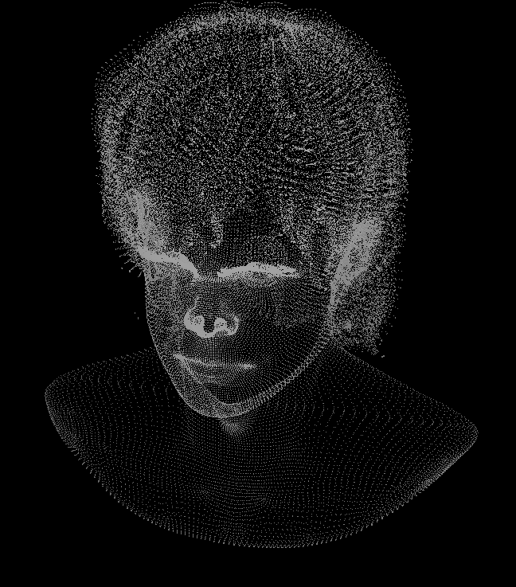

rustrast 04 - 3D transformation
===============================

For context, see the [main README](../).

In this chapter, I implement and optimise the mathematical calculations to project a 3D model to the screen with
perspective correction.

Nobody can be told what the matrix is
-------------------------------------

In the last chapter I did an adhoc projection of the model's vertex coordinates to the screen by taking advantage of the
model I chose having an orientation that matches the screen (z being perpendicular to the model's face) and scaling and
translating it to fit the window. Formalised 3D projection is, basically, the same, but with the addition of rotation to
account for the relative orientation between the viewer and the object, and scaling by the z axis.

Typically projection involves a number of tranformation steps carried out in order, each of which is a combination of
translations, scales and rotations. First, each model is transformed into its current position, size and orientation in
the world. The world is then transformed to have the camera look straight down the z-axis, and then further deformed to
emulate perspective. Finally, some more translation and scaling is done to make everything fit on the screen.

The standard way of teaching this is to use matrix multiplication. By expressing coordinates as four-element matrices,
with the x, y, and z coordinates and an additional scaling factor w that typically starts out as 1 ("homogenous
coordinates") you can scale, rotate, and translate by multiplying by a four-by-four matrix. Because matrix
multiplication is associative you can multiply a chain of transformations together and reuse that calculation for any
number of vertices. Using four-element matrices is an elegant hack that both allows for translation using matrix
multiplication, and, since a final divide is required to go from four-element homogenous coordinates back to regular
three-element coordinates, encodes the divide necessary for perpective projection.

Tinyrenderer describes this in [lesson 4](https://github.com/ssloy/tinyrenderer/wiki/Lesson-4:-Perspective-projection)
and [lesson 5](https://github.com/ssloy/tinyrenderer/wiki/Lesson-5:-Moving-the-camera); I originally learned it from
[chapter 6](https://archive.org/details/computergraphics0000unse_y3o2/page/228/mode/2up) of Computer Graphics: 
Principles and Practice. I'm not going to rehash it here; I'm interested in writing a fast implementation in Rust. Note
that both tinyrenderer and Computer Graphics: Principles and Practice use a premultiply convention - coordinates are
treated as single-column matrices, so the matrix is actually multiplied by the vector, and composition of tranformations
is done by multiplying the second transformation by the first. While the alternative postmultiply convention where
coordinated are treated as single-row matrices and are actually multipled by the matrix feels more expressive to me,
premultiplication seems to be used in almost every online example so I decided to use it. There's no practical
difference.

Something else to be careful about is coordinate system handedness. I've gone with right-handed (z increases towards the
viewer) here because the model I chose is right-handed. There are small differences between the projection matrices
depending on handedness, so make sure you use the correct ones at each step. For example, see Direct3D's
[D3DXMatrixPerspectiveRH](https://learn.microsoft.com/en-us/windows/win32/direct3d9/d3dxmatrixperspectiverh) vs
[D3DXMatrixPerspectiveLH](https://learn.microsoft.com/en-us/windows/win32/direct3d9/d3dxmatrixperspectivelh). Note that
those functions are deprecated but the documentation is better than the more modern replacements. Also note that not all
projection matrixes are equal: tinyrenderer uses an extremely simple one that just emulates perspective, whereas
Direct3D's and OpenGL's both distort the world so the visible part of it, after conversion back to cartesian coordinates
by dividing by w, is in a cuboidal area of a regular size centred on the origin that is very easy to clip against (the
"canonical view volume"). Direct3D's view volume goes from -1 to +1 on the x and y axes and from 0 to 1 on the z axis,
with more distant points having higher z regardless of whether you started with a right-handed or left-handed system.
OpenGL's is a cube from -1 to +1 in every dimension and each version retains its handedness. I chose to use Direct3D's
at this stage because the range of Z values feels a little more natural to me: anything <0 is behind the camera.

Also note that in the last chapter I drew to a [bottom-up
bitmap](https://learn.microsoft.com/en-us/windows/win32/api/wingdi/ns-wingdi-bitmapinfo#remarks) so higher y values were
at the top; this was actually an oversight and I initially assumed the model was upside down. Now the bitmap is the more
traditional top-down and the viewport transformation inverts the y values.

But first, an aside
-------------------

Memory is a strange thing. I distinctly remember mentioning to a friend when I was about fifteen that I had a
cycle-optimised vector-by-matrix multiplier written in assembly, and then realising that the Pentium's FPU was pipelined
and thus required a drastically different approach for high performance. I think it took a couple of evenings to
rewrite, and I have an absolutely clear memory that it divided the coordinates by a square root at the end and this took
an appreciable fraction of the time the entire multiplication took. However, while dividing by a square root is used in
3D - Hacker News finds the [fast inverse square root](https://en.wikipedia.org/wiki/Fast_inverse_square_root) from Quake
3 every few months - it's to normalise the length of a vector to 1, usually for lighting and wouldn't be done
immediately after a transformation. I must be remembering the divide by w to convert back to regular coordinates
instead. A floating point divide was very slow on a Pentium and didn't pipeline well so my memory isn't completely
faulty.

~Slow~Fast and steady
---------------------

After seeing how effectively the compiler optimised in chapter 2, I decided not to bother with attempting to make the
debug build in any way fast. The simplest data structure for a transformation uses a two dimensional array for the
matrix:

```rust
pub struct Transformation {
	matrix: [[f32; 4]; 4]
}
```

... and we already have a Vertex type from the object file parser we can reuse, but for clarity I chose to rename that
to reflect that it's homogenous coordinates, and add structs for cartesian coordinates and vectors:

```rust
pub struct CartesianVector {
    pub x: f32,
    pub y: f32,
    pub z: f32
}

// snip

pub struct HomogenousCoordinates {
    pub x: f32,
    pub y: f32,
    pub z: f32,
    pub w: f32
}

// snip

pub struct CartesianCoordinates {
    pub x: f32,
    pub y: f32,
    pub z: f32
}
```

The most naive implementations of the operations that are performed for every vertex are then:

```rust
pub fn transformed(&self, t: &Transformation) -> Self {
    let mut r = [0.0; 4];

    let a = t.matrix;
    for row in 0..4 {
        r[row] = a[row][0] * self.x + a[row][1] * self.y + a[row][2] * self.z + a[row][3] * self.w;
    }
    HomogenousCoordinates {x: r[0], y: r[1], z: r[2], w: r[3]}
}

pub fn to_cartesian(&self) -> CartesianCoordinates {
    CartesianCoordinates {
        x: self.x / self.w,
        y: self.y / self.w,
        z: self.z / self.w
    }
}
```

See [maths.rs](./rustrast/src/maths.rs) for all implementations, including utilities for creating the different types of
transformation.

In order to simplify things, I decided not to do any clipping against the view volume, so each vertex is multiplied by a
single matrix and then converted from homogenous coordinates back to cartesian just once.

After some messing about with the view volume, the result was pleasing:



Performance is pretty good. Transforming the ~100K vertices in the model takes 14ms in debug, but when optimised it
takes a little over 1ms. That's less than 10ns, or about 26 cycles, per vertex on my machine. That's fast enough to
presume that the compiler must be producing SIMD instructions. So, I decided to find out.

Some (dis)assembly required
---------------------------

The compiler is certainly using SIMD instructions, but the disassembly is hard to follow. The operations that matter are
transforming a vertex:

```assembly
_ZN8rustrast5maths21HomogenousCoordinates11transformed17h345139fd16498979E:
  00000001400055F0: 48 83 EC 38        sub         rsp,38h
  00000001400055F4: 44 0F 29 44 24 20  movaps      xmmword ptr [rsp+20h],xmm8
  00000001400055FA: 0F 29 7C 24 10     movaps      xmmword ptr [rsp+10h],xmm7
  00000001400055FF: 0F 29 34 24        movaps      xmmword ptr [rsp],xmm6
  0000000140005603: 48 89 C8           mov         rax,rcx
  0000000140005606: 0F 10 02           movups      xmm0,xmmword ptr [rdx]
  0000000140005609: F2 0F 10 22        movsd       xmm4,mmword ptr [rdx]
  000000014000560D: 0F 28 EC           movaps      xmm5,xmm4
  0000000140005610: 0F C6 EC 11        shufps      xmm5,xmm4,11h
  0000000140005614: F3 41 0F 10 70 10  movss       xmm6,dword ptr [r8+10h]
  000000014000561A: F3 41 0F 10 58 14  movss       xmm3,dword ptr [r8+14h]
  0000000140005620: F3 41 0F 10 48 18  movss       xmm1,dword ptr [r8+18h]
  0000000140005626: 41 0F 16 70 04     movhps      xmm6,qword ptr [r8+4]
  000000014000562B: F3 41 0F 10 50 1C  movss       xmm2,dword ptr [r8+1Ch]
  0000000140005631: F3 41 0F 10 78 24  movss       xmm7,dword ptr [r8+24h]
  0000000140005637: F3 45 0F 10 40 30  movss       xmm8,dword ptr [r8+30h]
  000000014000563D: 44 0F 16 C7        movlhps     xmm8,xmm7
  0000000140005641: 41 0F C6 F0 22     shufps      xmm6,xmm8,22h
  0000000140005646: 0F 59 F5           mulps       xmm6,xmm5
  0000000140005649: 41 0F 16 18        movhps      xmm3,qword ptr [r8]
  000000014000564D: 0F 16 E4           movlhps     xmm4,xmm4
  0000000140005650: F3 41 0F 10 68 20  movss       xmm5,dword ptr [r8+20h]
  0000000140005656: F3 41 0F 10 78 34  movss       xmm7,dword ptr [r8+34h]
  000000014000565C: 0F 16 FD           movlhps     xmm7,xmm5
  000000014000565F: 0F C6 DF 22        shufps      xmm3,xmm7,22h
  0000000140005663: 0F 59 DC           mulps       xmm3,xmm4
  0000000140005666: 0F 58 DE           addps       xmm3,xmm6
  0000000140005669: 0F 28 E0           movaps      xmm4,xmm0
  000000014000566C: 0F C6 E0 AA        shufps      xmm4,xmm0,0AAh
  0000000140005670: 41 0F 16 48 08     movhps      xmm1,qword ptr [r8+8]
  0000000140005675: F3 41 0F 10 68 28  movss       xmm5,dword ptr [r8+28h]
  000000014000567B: F3 41 0F 10 70 38  movss       xmm6,dword ptr [r8+38h]
  0000000140005681: 0F 16 F5           movlhps     xmm6,xmm5
  0000000140005684: 0F C6 CE 22        shufps      xmm1,xmm6,22h
  0000000140005688: 0F 59 CC           mulps       xmm1,xmm4
  000000014000568B: 0F 58 CB           addps       xmm1,xmm3
  000000014000568E: 0F C6 C0 FF        shufps      xmm0,xmm0,0FFh
  0000000140005692: 41 0F 16 50 0C     movhps      xmm2,qword ptr [r8+0Ch]
  0000000140005697: F3 41 0F 10 58 2C  movss       xmm3,dword ptr [r8+2Ch]
  000000014000569D: F3 41 0F 10 60 3C  movss       xmm4,dword ptr [r8+3Ch]
  00000001400056A3: 0F 16 E3           movlhps     xmm4,xmm3
  00000001400056A6: 0F C6 D4 22        shufps      xmm2,xmm4,22h
  00000001400056AA: 0F 59 D0           mulps       xmm2,xmm0
  00000001400056AD: 0F 58 D1           addps       xmm2,xmm1
  00000001400056B0: 0F 11 11           movups      xmmword ptr [rcx],xmm2
  00000001400056B3: 0F 28 34 24        movaps      xmm6,xmmword ptr [rsp]
  00000001400056B7: 0F 28 7C 24 10     movaps      xmm7,xmmword ptr [rsp+10h]
  00000001400056BC: 44 0F 28 44 24 20  movaps      xmm8,xmmword ptr [rsp+20h]
  00000001400056C2: 48 83 C4 38        add         rsp,38h
  00000001400056C6: C3                 ret
```
  
... and converting back to cartesian coordinates, which is inlined:
  
```assembly
  0000000140006866: F3 0F 10 45 DC     movss       xmm0,dword ptr [rbp-24h]
  000000014000686B: F3 0F 10 4D D8     movss       xmm1,dword ptr [rbp-28h]
  0000000140006870: F3 0F 5E C8        divss       xmm1,xmm0
  0000000140006874: F2 0F 10 55 D0     movsd       xmm2,mmword ptr [rbp-30h]
  0000000140006879: 0F 14 C0           unpcklps    xmm0,xmm0
  000000014000687C: 0F 5E D0           divps       xmm2,xmm0
  000000014000687F: 0F 13 53 F8        movlps      qword ptr [rbx-8],xmm2
  0000000140006883: F3 0F 11 0B        movss       dword ptr [rbx],xmm1
  0000000140006887: 48 8B 45 F8        mov         rax,qword ptr [rbp-8]
```

More, more!
-----------

While 26 cycles per transformed vertex is certainly fast, I thought it must be possible to do better! The first thing to
notice here is all the work needed to prepare SIMD registers. While the compiler has pivoted the loop to calculate the
result column-by-column, it still has to "swizzle" non-consecutive values into the registers. This is obvious if you
manually unroll the loop (note that this is no faster):

```rust
pub fn transformed(self, t: &Transformation) -> Self {
    let mut r: [f32; 4] = [0.0; 4];

    let a = t.matrix;

    r[0] = a[0][0] * self.x;
    r[1] = a[1][0] * self.x;
    r[2] = a[2][0] * self.x;
    r[3] = a[3][0] * self.x;

    r[0] = r[0] + a[0][1] * self.y;
    r[1] = r[1] + a[1][1] * self.y;
    r[2] = r[2] + a[2][1] * self.y;
    r[3] = r[3] + a[3][1] * self.y;

    r[0] = r[0] + a[0][2] * self.z;
    r[1] = r[1] + a[1][2] * self.z;
    r[2] = r[2] + a[2][2] * self.z;
    r[3] = r[3] + a[3][2] * self.z;

    r[0] = r[0] + a[0][3] * self.w;
    r[1] = r[1] + a[1][3] * self.w;
    r[2] = r[2] + a[2][3] * self.w;
    r[3] = r[3] + a[3][3] * self.w;

    HomogenousCoordinates {x: r[0], y: r[1], z: r[2], w: r[3]}
}
```

So, I reorganised the Transformation structure to store 4 columns instead of 4 rows:

```rust
pub fn transformed(&self, t: &Transformation) -> Self {
    let mut r = [0.0; 4];

    let a = &t.matrix;
    for row in 0..4 {
	    r[row] = a[0][row] * self.x + a[1][row] * self.y + a[2][row] * self.z + a[3][row] * self.w;
    }

    HomogenousCoordinates {x: r[0], y: r[1], z: r[2], w: r[3]}
}
```

This is an improvement: transforming takes about 0.5 - 0.7ms, and the resulting disassembly is much shorter and easier
to follow:

```assembly
_ZN8rustrast5maths21HomogenousCoordinates11transformed17he0f3e2c7a40d87eeE:
  0000000140005530: 48 89 C8           mov         rax,rcx
  0000000140005533: 0F 10 02           movups      xmm0,xmmword ptr [rdx]
  0000000140005536: 0F 28 C8           movaps      xmm1,xmm0
  0000000140005539: 0F C6 C8 00        shufps      xmm1,xmm0,0
  000000014000553D: 41 0F 59 08        mulps       xmm1,xmmword ptr [r8]
  0000000140005541: 0F 28 D0           movaps      xmm2,xmm0
  0000000140005544: 0F C6 D0 55        shufps      xmm2,xmm0,55h
  0000000140005548: 41 0F 59 50 10     mulps       xmm2,xmmword ptr [r8+10h]
  000000014000554D: 0F 28 D8           movaps      xmm3,xmm0
  0000000140005550: 0F C6 D8 AA        shufps      xmm3,xmm0,0AAh
  0000000140005554: 41 0F 59 58 20     mulps       xmm3,xmmword ptr [r8+20h]
  0000000140005559: 0F 58 D1           addps       xmm2,xmm1
  000000014000555C: 0F C6 C0 FF        shufps      xmm0,xmm0,0FFh
  0000000140005560: 41 0F 59 40 30     mulps       xmm0,xmmword ptr [r8+30h]
  0000000140005565: 0F 58 DA           addps       xmm3,xmm2
  0000000140005568: 0F 58 C3           addps       xmm0,xmm3
  000000014000556B: 0F 11 01           movups      xmmword ptr [rcx],xmm0
  000000014000556E: C3                 ret
```

It's still just using SSE instructions to process 4 values at a time. AVX2 can do 8 single-precision float operations at
a time instead of 4, so I wanted to test if that was faster. First, I tried compiling the existing code for the
processor in my machine which supports up to AVX2 using `cargo rustc --bin rustrast -- -C target-cpu=native`, but the
only way I could get the compiler to use AVX instructions was to annotate it with `target_feature`. The result was no
faster:

```assembly
_ZN8rustrast5maths21HomogenousCoordinates11transformed17h98f29f12215796a7E:
  0000000140005530: C4 E2 79 18 02     vbroadcastss xmm0,dword ptr [rdx]
  0000000140005535: C4 C1 78 59 00     vmulps      xmm0,xmm0,xmmword ptr [r8]
  000000014000553A: C4 E2 79 18 4A 04  vbroadcastss xmm1,dword ptr [rdx+4]
  0000000140005540: C4 C1 70 59 48 10  vmulps      xmm1,xmm1,xmmword ptr [r8+10h]
  0000000140005546: 48 89 C8           mov         rax,rcx
  0000000140005549: C4 E2 79 18 52 08  vbroadcastss xmm2,dword ptr [rdx+8]
  000000014000554F: C4 C1 68 59 50 20  vmulps      xmm2,xmm2,xmmword ptr [r8+20h]
  0000000140005555: C5 F8 58 C1        vaddps      xmm0,xmm0,xmm1
  0000000140005559: C4 E2 79 18 4A 0C  vbroadcastss xmm1,dword ptr [rdx+0Ch]
  000000014000555F: C4 C1 70 59 48 30  vmulps      xmm1,xmm1,xmmword ptr [r8+30h]
  0000000140005565: C5 F8 58 C2        vaddps      xmm0,xmm0,xmm2
  0000000140005569: C5 F8 58 C1        vaddps      xmm0,xmm0,xmm1
  000000014000556D: C5 F8 11 01        vmovups     xmmword ptr [rcx],xmm0
  0000000140005571: C3                 ret
```

Since the compiler seemed unwilling to use 256 bit operations, I tried writing my own:

```rust
#[target_feature(enable = "fma,avx2")]
pub unsafe fn transformed_avx2(&self, t: &Transformation) -> Self {
    let c01: *const __m256 = transmute(&t.matrix[0][0]);
    let xy = _mm256_set_ps(self.y, self.y, self.y, self.y, self.x, self.x, self.x, self.x);
    let r01 = _mm256_mul_ps(*c01, xy);

    let c23: *const __m256 = transmute(&t.matrix[2][0]);
    let zw = _mm256_set_ps(self.w, self.w, self.w, self.w, self.z, self.z, self.z, self.z);
    let r02_13: [__m128; 2] = transmute(_mm256_fmadd_ps(*c23, zw, r01));

    let r = _mm_add_ps(r02_13[0], r02_13[1]);

    let r_arr: [f32; 4] = transmute(r);
    HomogenousCoordinates {x: r_arr[0], y: r_arr[1], z: r_arr[2], w: r_arr[3]}
}
```

But despite only doing two multiplies, it isn't faster. Again, swizzling is adding unavoidable extra operations:

```assembly
_ZN8rustrast5maths21HomogenousCoordinates16transformed_avx217h3af60caebd51cd7cE:
  0000000140005520: 48 89 C8           mov         rax,rcx
  0000000140005523: C5 FB 10 02        vmovsd      xmm0,qword ptr [rdx]
  0000000140005527: C5 FB 10 4A 08     vmovsd      xmm1,qword ptr [rdx+8]
  000000014000552C: C4 E3 79 04 C0 50  vpermilps   xmm0,xmm0,50h
  0000000140005532: C4 E3 FD 01 C0 50  vpermpd     ymm0,ymm0,50h
  0000000140005538: C4 C1 7C 59 00     vmulps      ymm0,ymm0,ymmword ptr [r8]
  000000014000553D: C4 E3 79 04 C9 50  vpermilps   xmm1,xmm1,50h
  0000000140005543: C4 E3 FD 01 C9 50  vpermpd     ymm1,ymm1,50h
  0000000140005549: C4 C2 7D 98 48 20  vfmadd132ps ymm1,ymm0,ymmword ptr [r8+20h]
  000000014000554F: C4 E3 7D 19 C8 01  vextractf128 xmm0,ymm1,1
  0000000140005555: C5 F0 58 C0        vaddps      xmm0,xmm1,xmm0
  0000000140005559: C5 F8 11 01        vmovups     xmmword ptr [rcx],xmm0
  000000014000555D: C5 F8 77           vzeroupper
  0000000140005560: C3                 ret
```

In order to eliminate swizzling and make full use of the vector processor, I pivoted how vertices are stored to store xs
together, ys together, and so on, thus allowing all eight lanes to be used without any horizontal operations:

```rust
#[target_feature(enable = "fma,avx,avx2")]
pub unsafe fn simd_transformed_to_cartesian(dest: &mut[CoordinateComponents; 3], model: &Model, t: &Transformation) {
    let xs: *const __m256 = model.xs.as_ptr() as *const __m256;
    let ys: *const __m256 = model.ys.as_ptr() as *const __m256;
    let zs: *const __m256 = model.zs.as_ptr() as *const __m256;
    let ws: *const __m256 = model.ws.as_ptr() as *const __m256;
    let d: [*mut __m256; 3] = [dest[0].as_mut_ptr() as *mut __m256, dest[1].as_mut_ptr() as *mut __m256, dest[2].as_mut_ptr() as *mut __m256];
    for row in 0..3 {
        let c0 = _mm256_set1_ps(t.matrix[0][row]);
        let c1 = _mm256_set1_ps(t.matrix[1][row]);
        let c2 = _mm256_set1_ps(t.matrix[2][row]);
        let c3 = _mm256_set1_ps(t.matrix[3][row]);
        
        for i in (0 as isize)..(model.num_vertices as isize / 8) {
            let mut r = _mm256_mul_ps(*xs.offset(i), c0);
            r = _mm256_fmadd_ps(*ys.offset(i), c1, r);
            r = _mm256_fmadd_ps(*zs.offset(i), c2, r);
            *d[row].offset(i) = _mm256_fmadd_ps(*ws.offset(i), c3, r);
        }
    }

    let c03 = _mm256_set1_ps(t.matrix[0][3]);
    let c13 = _mm256_set1_ps(t.matrix[1][3]);
    let c23 = _mm256_set1_ps(t.matrix[2][3]);
    let c33 = _mm256_set1_ps(t.matrix[3][3]);        

    for i in (0 as isize)..(model.num_vertices as isize / 8) {
        let mut r = _mm256_mul_ps(*xs.offset(i), c03);
        r = _mm256_fmadd_ps(*ys.offset(i), c13, r);
        r = _mm256_fmadd_ps(*zs.offset(i), c23, r);
        r = _mm256_fmadd_ps(*ws.offset(i), c33, r);
        
        *d[0].offset(i) = _mm256_div_ps(*d[0].offset(i), r);
        *d[1].offset(i) = _mm256_div_ps(*d[1].offset(i), r);
        *d[2].offset(i) = _mm256_div_ps(*d[2].offset(i), r);
    }

    for i in ((model.num_vertices / 8) * 8)..(model.num_vertices) {
        let r = HomogenousCoordinates {
            x: model.xs[i], 
            y: model.ys[i], 
            z: model.zs[i], 
            w: model.ws[i]}.transformed(t).to_cartesian();
        dest[0][i] = r.x;
        dest[1][i] = r.y;
        dest[2][i] = r.z;
    }
}
```

`CoordinateComponents` is a wrapper around [AVec](https://docs.rs/aligned-vec/latest/aligned_vec/struct.AVec.html) to
ensure alignment without exposing how to the calling code. This is a bit faster, at about 0.4ms-0.6ms to transform all
vertices in release mode. This version doesn't need the transformation matrices to be stored as columns, but I decided
to leave them that way to allow the simple implementations to be fast.

At this point I increased the alignment to 128 bytes (newer Intels load a pair of 64 byte cache lines at once) but there
wasn't much, if any, impact on performance.

Note that I decided to pretty much ignore memory management, at this point at least. Instead, the same output buffers
are used to store transformed coordinates each frame. 20 minutes or so of searching didn't give me a clear answer as to
how modern games manage memory so this is good enough for now.

Parallel lines never meet
-------------------------

My Dell has a Comet Lake-H processor with 6 cores, and at least one AVX2 unit per core. I think there may actually be
two multiply-add units on each core, so it can potentially run 12 instances of the loop above at full speed, at least
until it's throttled due to excess heat. Of course memory bandwidth will come into play at some point.

Rust has a popular parallel collections library called [Rayon](https://docs.rs/rayon/latest/rayon/) so that's what I
used at first. However, using it to do a parallel map suggested that the overhead of splitting and joining a collection
is significant for this workload. Here's an example, although timings do seem to be more variable than for a single
thread:

```
1368693877.48-1368693877.57: Transformed slice in 0.10ms
1368693877.57-1368693877.74: Transformed slice in 0.17ms
1368693877.59-1368693877.79: Transformed slice in 0.20ms
1368693877.50-1368693877.72: Transformed slice in 0.22ms
1368693877.58-1368693877.76: Transformed slice in 0.17ms
1368693877.58-1368693877.75: Transformed slice in 0.16ms
1368693877.38-1368693877.89: Transformed 108977 vertices in 0.51ms
```

Notice the 0.1ms gap until the first slice was transformed and after the last. So, next I tried using its thread pool
directly, and using a channel for synchronisation instead of using Rayon's recursive fork/join (as that would basically
be reimplementing the parallel map):

```
1371555364.25-1371555364.33: Transformed slice in 0.08ms
1371555364.26-1371555364.37: Transformed slice in 0.11ms
1371555364.29-1371555364.41: Transformed slice in 0.13ms
1371555364.29-1371555364.42: Transformed slice in 0.12ms
1371555364.29-1371555364.42: Transformed slice in 0.13ms
1371555364.29-1371555364.43: Transformed slice in 0.14ms
1371555364.21-1371555364.49: Transformed 108977 vertices in 0.28ms
```

There's still some time spent in setup and teardown, although I think most of the time in teardown is actually spent
printing the slice timings. My final experiment was to build the simplest possible thread pool, based on the one from
[the final chapter of the Rust book](https://doc.rust-lang.org/stable/book/ch20-02-multithreaded.html):

```
1371952669.41-1371952669.52: Transformed slice in 0.12ms
1371952669.43-1371952669.61: Transformed slice in 0.19ms
1371952669.48-1371952669.62: Transformed slice in 0.14ms
1371952669.48-1371952669.63: Transformed slice in 0.14ms
1371952669.46-1371952669.63: Transformed slice in 0.16ms
1371952669.47-1371952669.63: Transformed slice in 0.16ms
1371952669.39-1371952669.70: Transformed 108977 vertices in 0.31ms
```

The improvement over just a single thread is disappointing. By artificially increasing the workload 16 times and
experimenting I found sharply diminishing returns after about 3 or 4 threads, so I decided to set it to 3 for now.
Perhaps in a future chapter there might be a gain from rendering or bitblt-ing a frame in parallel with transforming the
next.

At this point by far the most time-consuming operation is sorting the vertices in z order; that will go away in the next
chapter when I introduce a z buffer to correctly render polygons.

Am I a Rustacean yet?
---------------------

As expected, lifetimes caused a lot of compiler errors as a I played around with concurrency. The compiler continued to
give excellent error messages. I enjoyed the operator overloading, including the ability to overload indexing.

The standard library is limited, and something being on Docs.rs doesn't mean it's standard or endorsed. The download
statistics on crates.io seem to be the best indicator of quality.

Next up, [filled polygons](../rustrast-05/).
