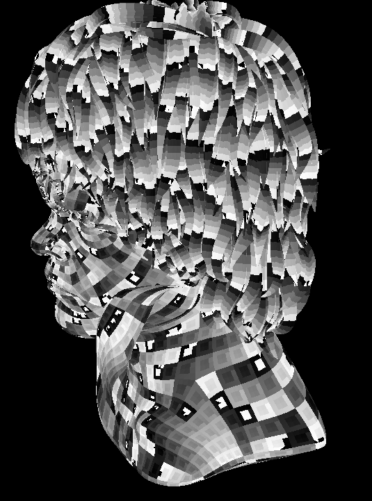

rustrast 05 - Filled polygons
=============================

For context, see the [main README](../).

In this chapter, I draw filled, flat shaded triangles instead of just vertices and the model starts to look more real.

The Times They Are A Changing
-----------------------------

When I experimented with 3D in the 1990s, there was a standard way to draw a filled polygon on screen: break it into
triangles with a horizontal top or bottom, draw each edge row-by-row up or down the screen using 
[Bresenham's algorithm](https://en.wikipedia.org/wiki/Bresenham%27s_line_algorithm), and fill in the pixels along each
line. This certainly works, but some of the restrictions that led to it becoming the standard thirty or more years ago
no longer exist: floating point instructions are now as cheap as integer ones; memory bandwidth is immense meaning you
don't need to expend so much effort on avoiding over-drawing the same pixels multiple times; computational power
increased allowing scenes to be made of a huge number of tiny polygons; and critically, GPUs became extremely wide SIMD
processors which don't work particularly well with the heavy branching of an edge walking algorithm.

[One of Michael Abrash's Dr. Dobbs articles](https://jacobfilipp.com/DrDobbs/articles/DDJ/1997/9713/9713g/9713g.htm)
that I remember from that period hinted at how the state of the art would move, without actually being the same: Quake
drew the tiny triangles that made up a distant character model by drawing the vertices, then subdividing the triangle by
splitting an edge at its midpoint and drawing that new vertex, then continuing with the two new triangles. For very
small triangles this approach of giving up on the idea of doing the least amount of work possible, and instead doing
perhaps more work very quickly, proved to be quicker than doing the setup required of the more traditional method.

Similarly, the modern recommended method, first described by [Pineda in
1988](https://www.cs.drexel.edu/~deb39/Classes/Papers/comp175-06-pineda.pdf), seems too simple: traverse every pixel in
the triangle's bounding box, and fill the ones that are inside the triangle. Some obvious optimisations suggest
themselves and many are explored in the paper. [A paper by
Haykal](https://www.digipen.edu/sites/default/files/public/docs/theses/salem-haykal-digipen-master-of-science-in-computer-science-thesis-an-optimized-triangle-rasterizer.pdf)
explores further.

Just like earlier - over two years earlier, how time flies - I decided to start with a naive implementation and then
reimplement using AVX2 intrinsics. After a quick update of Rust and Visual Studio Code, I got to it.

Baby's first rasteriser
-----------------------

First, I need triangles. The model I've been using has quads in it, and I assume they are convex, so I chose to
[fan triangulate](https://en.wikipedia.org/wiki/Polygon_triangulation) when loading the model.

After making some adjustments to a lot of online examples required to deal with my viewport transform flipping the y
direction, I got a working triangle fill. I've left out the [top-left fill
rule](https://learn.microsoft.com/en-us/windows/win32/direct3d11/d3d10-graphics-programming-guide-rasterizer-stage-rules)
for simplicity here, but it is implemented in the code.

```rust
fn edge_function(x0: f32, y0: f32, x1: f32, y1: f32, xp: f32, yp: f32) -> f32 {
    // this is backwards from a lot of examples due to our projection inverting the y axis
    (x1-x0)*(y0-yp) - (y0-y1)*(xp-x0)
}

pub unsafe fn fill_triangle(buffer: *mut RGBQUAD, width: u16, height: u16, x0: f32, y0: f32, x1: f32, y1: f32, x2: f32, y2: f32, colour: RGBQUAD) {
    // cull backwards facing triangles
    if edge_function(x0, y0, x1, y1, x2, y2) <= 0.0 {
        return;
    }
    
    // bounding box, clipped to screen
    let xmin = min3(x0, x1, x2).max(0.0).floor();
    let ymin = min3(y0, y1, y2).max(0.0).floor();
    let xmax = max3(x0, x1, x2).min((width - 1) as f32).ceil();
    let ymax = max3(y0, y1, y2).min((height - 1) as f32).ceil();

    // check if every pixel centre in the bounding box is inside the triangle
    let mut yp = ymin + 0.5;
    while yp <= ymax {
        let mut xp = xmin + 0.5;
        while xp <= xmax {
            let w0 = edge_function(x0, y0, x1, y1, xp, yp);
            let w1 = edge_function(x1, y1, x2, y2, xp, yp);
            let w2 = edge_function(x2, y2, x0, y0, xp, yp);
            
            if w0 >= 0.0 &&  w1 >= 0.0 && w2 >= 0.0 {
                *buffer.offset(((yp as isize) * (width as isize)) + (xp as isize)) = colour;
            }

            xp += 1.0;        
        }
        
        yp += 1.0;
    }
}
```

The result is as expected; I picked an angle where the order of objects in the model accidentally rendered mostly back-
to-front:



Performance is passable: maximised on a 1920 x 1200 screen, the 217098 triangles in our model take about 40ms to fill.
Before examining the assembly and writing SIMD code by hand, there is one purely mathematical optimisation: if you
substitute `xp + 1` for `xp` into the edge function you can see that for a given edge, the value of the function for
`xp + 1, yp` is the value for `xp, yp` minus `y0-y1`. Similarly, the value for `xp, yp + 1` is the value for `xp, yp`
minus `x1-x0`. The performance gain from this was solid: going from seven arithmetic operations per edge per pixel to
just one knocked about 15ms off the time to rasterise the model. However, repeatedly adding a constant like this can
compound the lack of precision inherent in floating point numbers, and could lead to visible gaps between triangles that
share an edge (although I didn't see that). This optimisation is implemented in the code.

The next obvious optimisation would be to try to avoid testing some pixels at all, either by detecting edges and moving
to the next scanline as suggested by Pineda, or by eliminating small blocks of pixels in one operation. I decided not to
do this yet; I suspect that for small triangles branching may be worse than testing all pixels.

An AVX2 version was pretty straightforward: operate on spans of 8 pixels at a time, implement the incremental version
described above, and the implementation pretty much suggests itself:

```rust
#[target_feature(enable = "avx,avx2")]
pub unsafe fn avx2_fill_triangle(buffer: *mut RGBQUAD, width: u16, height: u16, x0: f32, y0: f32, x1: f32, y1: f32, x2: f32, y2: f32, colour: RGBQUAD) {
    debug_assert!(buffer.align_offset(32) == 0);
    debug_assert!(width % 8 == 0);

    // cull backwards facing triangles
    if edge_function(x0, y0, x1, y1, x2, y2) <= 0.0 {
        return;
    }
    
    // bounding box, clipped to screen, adjusted to 8 pixel wide spans
    let xmin = (min3(x0, x1, x2).max(0.0) / 8.0).floor() as isize;
    let ymin = min3(y0, y1, y2).max(0.0).floor() as isize;
    let xmax = (max3(x0, x1, x2).min((width - 1) as f32) / 8.0).ceil() as isize;
    let ymax = max3(y0, y1, y2).min((height - 1) as f32).ceil() as isize;

    // values of the edge functions for the first pixel on the first row of the bounding box
    let mut row_w0 = _mm256_set1_ps(edge_function(x0, y0, x1, y1, (xmin as f32) * 8.0 + 0.5, (ymin as f32) + 0.5));
    let mut row_w1 = _mm256_set1_ps(edge_function(x1, y1, x2, y2, (xmin as f32) * 8.0 + 0.5, (ymin as f32) + 0.5));
    let mut row_w2 = _mm256_set1_ps(edge_function(x2, y2, x0, y0, (xmin as f32) * 8.0 + 0.5, (ymin as f32) + 0.5));

    // if you substitute `xp + 1` for `xp` into the edge function you can see that
    // for a given edge, the value of the function for `xp + 1, yp` is the value for `xp, yp` minus `y0-y1`
    let mut xstep0 = _mm256_set1_ps(y0-y1);
    let mut xstep1 = _mm256_set1_ps(y1-y2);
    let mut xstep2 = _mm256_set1_ps(y2-y0);

    // adjust to the values for the first eight pixels on the first row
    let zero_to_seven = _mm256_set_ps(7.0, 6.0, 5.0, 4.0, 3.0, 2.0, 1.0, 0.0);
    row_w0 = _mm256_sub_ps(row_w0, _mm256_mul_ps(xstep0, zero_to_seven));
    row_w1 = _mm256_sub_ps(row_w1, _mm256_mul_ps(xstep1, zero_to_seven));
    row_w2 = _mm256_sub_ps(row_w2, _mm256_mul_ps(xstep2, zero_to_seven));

    // step to the next span of 8
    let eight = _mm256_set1_ps(8.0);
    xstep0 = _mm256_mul_ps(xstep0, eight);
    xstep1 = _mm256_mul_ps(xstep1, eight);
    xstep2 = _mm256_mul_ps(xstep2, eight);

    // as above, the value of the edge function for `xp, yp + 1` is the value for `xp,yp` minus `x1-x0`. 
    let ystep0 = _mm256_set1_ps(x1-x0);
    let ystep1 = _mm256_set1_ps(x2-x1);
    let ystep2 = _mm256_set1_ps(x0-x2);

    let zero = _mm256_setzero_ps();
    let filled_span = _mm256_set1_epi32(*(((&colour) as *const RGBQUAD) as *const i32));
    let buffer = buffer as *mut __m256i;
    let width = width as isize / 8;

    let mut yp = ymin;
    while yp <= ymax {
        let mut w0 = row_w0;
        let mut w1 = row_w1;
        let mut w2 = row_w2;
        let mut xp = xmin;
        while xp < xmax { // not <= because of ceil(div by eight), above
            let inside0 = _mm256_castps_si256(_mm256_cmp_ps(w0, zero, _CMP_GE_OQ));
            let inside1 = _mm256_castps_si256(_mm256_cmp_ps(w1, zero, _CMP_GE_OQ));
            let inside2 = _mm256_castps_si256(_mm256_cmp_ps(w2, zero, _CMP_GE_OQ));
            let inside = _mm256_and_si256(inside0, _mm256_and_si256(inside1, inside2));

            let filled_pixels = _mm256_and_si256(inside, filled_span);
            let bg_pixels = _mm256_andnot_si256(inside, *buffer.offset((yp * width) + xp));
            *buffer.offset((yp * width) + xp) = _mm256_or_si256(bg_pixels, filled_pixels);

            xp += 1; 

            w0 = _mm256_sub_ps(w0, xstep0);
            w1 = _mm256_sub_ps(w1, xstep1);
            w2 = _mm256_sub_ps(w2, xstep2);
        }
        
        yp += 1;

        row_w0 = _mm256_sub_ps(row_w0, ystep0);
        row_w1 = _mm256_sub_ps(row_w1, ystep1);
        row_w2 = _mm256_sub_ps(row_w2, ystep2);
    }
}
```

There's not much of interest, really. I made the buffer always a multiple of 8 wide, with a strip of un-BitBlted pixels
on the right, to simplify dealing with unaligned starts and ends of lines. I chose to use the existing edge function and
adjust the result for the first eight pixels rather than calculate the first eight values in parallel; this is probably
costing a few cycles per triangle but saves a lot of code. The fact that a single precision float and an RGB quad are
both 32 bits comes in handy when setting the filled pixels in the buffer: `_mm256_cmp_ps` sets 32 bits for each lane
that passes the comparison, which can then be used to mask and set just the filled pixels while leaving the background
intact.

Performance is impressive: about 7ms per frame, down from about 25ms for the non-explicit-SIMD version that uses the
same incremental approach. I don't expect to make any significant improvement on that.

While a fill rule isn't hugely important given I'm using floating point - very few pixel centres lie exactly on an edge
- I did want to implement it for the sake of completeness. First, testing if an edge is a top or left one is trivial
given our triangles are always passed with vertices in counterclockwise order:

```rust
fn is_top_or_left(x0: f32, y0: f32, x1: f32, y1: f32) -> bool {
    // top                   left (assuming counterclockwise, inverted y axis)
    (y0 == y1 && x0 > x1) || (y1 < y0)
}
```

Then, instead of always checking if the edge function is greater than or equal to zero, you do that for edges that are
top or left, and check if it's strictly greater than zero for other edges. This also deals with shared vertices: a pixel
centre lying exactly on a shared vertex will only be drawn on the triangle where that vertex is between two left edges
or a top edge and a left edge.

Doing this naively, using if - else, in the AVX2 version imposed almost no penalty: about 0.5ms per frame. The
disassembly is hard to follow, but I think the compiler has decided to execute both comparisons and select the correct
result using a bit mask. The AVX2 compare instruction has a throughput of 0.5 cycles, which I think means that two of
them can exit the pipeline at once.

The low cost makes it pretty pointless to try to optimise, but there are a few options. Simplest is to nudge the value
of the edge function above zero for top or left edges and then check for strictly above zero. For floating points this
means adding a small epsilon, and I don't like that: it effectively makes that edge wider, which introduces the same
overdrawing that a fill rule is supposed to avoid. Also, the cheapest way to do this is to add the epsilon once, to the
starting values of the edge function, but in future we will be using those values to interpolate things like z values
and texture coordinates so I would prefer to keep them unaltered (although I could subtract the epsilon after the inside
test).

Another option would be to implement six versions of the inner loop for each possible combination of whether an edge is
a top or left edge (neither all top/left edges or none is possible). However, since the same branches are taken every
time for a given triangle and thus should be predicted well, I don't expect this would be worth the extra complexity.

If something's worth doing, it's worth doing multiple times in parallel
-----------------------------------------------------------------------

As with transformation, the next thing to try is multithreading. And as before, I wasn't sure what to do. I can't have
multiple threads updating the same pixels (or spans of pixels) as that would require synchronisation. One approach is to
break the screen into tiles, and rasterise multiple tiles in parallel. Note that mobile phone GPUs do this to reduce the
amount of memory needed for buffers. [Michael Abrash wrote an article mostly about selecting the triangles in a tile for
Dr Dobbs](https://www.gamedeveloper.com/programming/sponsored-feature-rasterization-on-larrabee----adaptive-rasterization-helps-boost-efficiency)
in 2009. Since I've assumed many tiny triangles for this exercise, a simple bounding box test is all I'm willing to do.

Alternatively, I could project and rasterise multiple frames in parallel. However, I don't think this approach would
scale well: it wouldn't reduce the latency of a single frame which would be particularly bad for a game; also with many
concurrent frames the total size of buffers would quickly exceed cache memory.

So, my first attempt was to rasterise to tiles, which meant I needed to compute the bounding boxes before drawing any
triangles. This made me realise that the simple code I was using to calculate bounding boxes was quite slow: about 3ms
per frame. While this is certainly parallelisable, that's several times as expensive as projecting vertices so I wrote
an AVX2 version to calculate the bounds of eight triangles at a time, which took about a little over 1ms per frame with
no parallelism. I used the AVX2 `_mm256_i32gather_ps` intrinsic to load the projected coordinates for each of the three
vertices in the triangles being worked on; I presume it was intended for this:

```rust
let x0 = _mm256_i32gather_ps(xs.as_ptr(), v0s[triangles_offset + i], 4);
	let y0 = _mm256_i32gather_ps(ys.as_ptr(), v0s[triangles_offset + i], 4);
	let x1 = _mm256_i32gather_ps(xs.as_ptr(), v1s[triangles_offset + i], 4);
	let y1 = _mm256_i32gather_ps(ys.as_ptr(), v1s[triangles_offset + i], 4);
	let x2 = _mm256_i32gather_ps(xs.as_ptr(), v2s[triangles_offset + i], 4);
	let y2 = _mm256_i32gather_ps(ys.as_ptr(), v2s[triangles_offset + i], 4);

	// cull backwards facing triangles
	let backface = _mm256_cmp_ps(_mm256_sub_ps(
		_mm256_mul_ps(_mm256_sub_ps(x1, x0), _mm256_sub_ps(y0, y2)),
		_mm256_mul_ps(_mm256_sub_ps(y0, y1), _mm256_sub_ps(x2, x0))), _mm256_setzero_ps(), _CMP_LE_OQ);
	let backface_xmax = _mm256_and_ps(backface, _mm256_set1_ps(-1.0));

	xmins_out[i] = _mm256_andnot_ps(backface, _mm256_floor_ps(_mm256_max_ps(_mm256_min_ps(_mm256_min_ps(x0, x1), x2), _mm256_set1_ps(xmin))));
	ymins_out[i] = _mm256_andnot_ps(backface, _mm256_floor_ps(_mm256_max_ps(_mm256_min_ps(_mm256_min_ps(y0, y1), y2), _mm256_set1_ps(ymin))));
	xmaxs_out[i] = _mm256_or_ps(backface_xmax, _mm256_andnot_ps(backface, _mm256_ceil_ps(_mm256_min_ps(_mm256_max_ps(_mm256_max_ps(x0, x1), x2), _mm256_set1_ps(xmax)))));
	ymaxs_out[i] = _mm256_andnot_ps(backface, _mm256_ceil_ps(_mm256_min_ps(_mm256_max_ps(_mm256_max_ps(y0, y1), y2), _mm256_set1_ps(ymax))));
```

Note the slightly-hacky way I indicate a backwards facing triangle by giving it a bounding box with negative width.

Similar to projection, performance did not improve with more than four threads; with four threads calculating bounding
boxes (and culling backwards-facing triangles) takes about 0.5ms. Somewhat surprisingly, moving bounding box calculation
and backface culling out of the AVX2 triangle fill routing does not seem to speed up the triangle fill; this may be
because the calculations were being done at the same time as the first edge functions.

Along the way I realised that bounding boxes can be a bit inaccurate so long as they continue to fully contain the
triangle, but unfortunately most operations on half precision floats that would let me calculate sixteen bounding boxes
at once are in AVX512, which is not supported by my aging laptop.

Anyway, I chose 128 pixel square tiles, and chose to avoid thinking about memory allocation again by enumerating all
triangles when rendering a tile, quickly discarding and clipping triangles based on the precalculated bounds. This was
disappointing: using the AVX2 rasteriser and a single thread took about as long as very first, unoptimised, untiled
version did, and even at four threads (after which performance got worse), it was slightly slower than not using tiles
at all. Tiling did slightly improve the optimised but not-explicit-SIMD rasteriser, but only with four or more threads.
256 pixel square tiles made a big improvement, strongly suggesting that the approach of enumerating all triangles for
each tile and quickly culling was a bad one.

Therefore my next attempt was to assign triangles to between one to four bins, according to the tile where each of their
bounding box corners is. Doing this without dynamic memory allocation meant creating large buffers, but there was an
immediate improvement: while binning took around 0.75ms, triangle filling finally benefitted from multithreading,
bringing the total time to calculate bounding boxes, bin triangles, and fill them to well under 4ms with four threads.

I couldn't let it be, so I parallelised binning by storing as many lists of triangles per tile as threads, and adding
some dynamic memory management (at least for the first couple of frames after resizing the window) and got the time
taken down to just under 0.5ms using four threads; hardly worth the effort but maybe a larger scene would show more
impact. And with that, it was time to move on.

My Rust is rusty
----------------

Coming back to this after such a long break was tricky: Rust has a steep learning curve, and I hadn't climbed anywhere
near the top last time so I found it difficult to write anything. The compiler was helpful as usual.

All the multithreading this time encouraged me to do more reading and figure out scoped threads (well, the somewhat-
deprecated `scoped_threadpool`) and chunks so I could eliminate a lot of the unsafe annotations or move them to just the
code that uses SIMD intrinsics.

Next, we'll finally get some realism with [lighting and z-buffering](../rustrast-06/).
