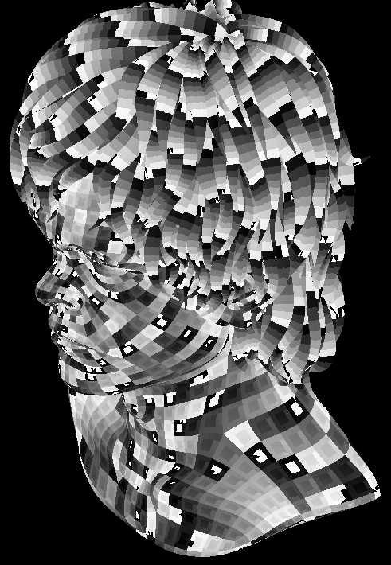
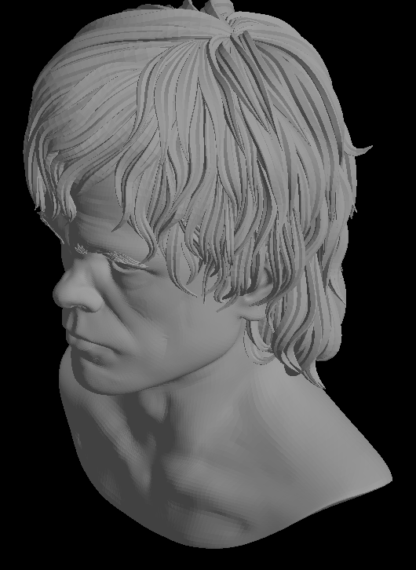

rustrast 06 - Hidden surface removal and lighting
=================================================

For context, see the [main README](../).

In this installment, I implement a depth buffer and basic lighting so the model starts to look solid.

...we do not look at the things which are unseen, but at the things which are seen
----------------------------------------------------------------------------------

I never got beyond rotating cubes when I played with 3D in the 1990s, so the only hidden surface removal I needed was to
cull backwards facing triangles. I did know the various techniques from my well-thumbed Computer Graphics: Principles
and Practice, but unfortunately I don't have that now, and the Internet Archive seems not to allow borrowing it any
more. From memory, hardware at the time used Z-buffers, and software tended to use simple geometry so back-to-front
drawing dealt with the problem. The then-common scanline rasterising technique also leant itself to writing metadata
about the scanlines for each polygon to a tree, clipping and deleting any that were obscured, and then rasterising just
the spans that were visible. [Michael Abrash described Quake's implementation of this in his Graphics Programming Black
Book](https://github.com/jagregory/abrash-black-book/blob/master/src/chapter-64.md). Something that I don't remember,
but read during the research I did for rasterisation, is how to interpolate the depth values for each pixel in a
triangle without distortion due to perspective. It's simple - interpolate the reciprocal - but [a widely cited paper by
Kok-Lim Low about perspective correct interpolation](https://www.researchgate.net/publication/2893969_Perspective-Correct_Interpolation)
is from 2002 which can't be when it was invented: [John Carmack's well-known nixing of an accelerated but incorrect
Sega Saturn port of Doom](https://www.doomwiki.org/wiki/Doom_(Sega_Saturn)) was around 1997.

I also wasn't aware of how many slightly different versions of "depth" you can choose between: the projected z or its
inverse; z but with higher values closer to the camera; the homogenous w or its inverse. Each has different precision
characteristics and it can be hard to figure out whether what you're reading applies to fixed point or floating point
which adds its own! The concept of depth is also intimately tied to interpolating things like lighting or texture
coordinates in a perspective-correct way across the surface of the triangle. The fundamental concept is barycentric
coordinates - describing a point inside a triangle in terms of the areas of the three sub-triangles it makes when you
connect it to each vertex - and [the clearest explanation of barycentric coordinates that I found was
Scratchapixel's](https://www.scratchapixel.com/lessons/3d-basic-rendering/rasterization-practical-implementation/rasterization-stage.html).

For the specifics of perspective correct interpolation I decided to use division by the homogenous w, [which is what I
believe OpenGL uses](https://stackoverflow.com/questions/24441631/how-exactly-does-opengl-do-perspectively-correct-linear-interpolation);
I found some slightly easier code in [another excellent series about writing a
rasteriser](https://lisyarus.github.io/blog/posts/implementing-a-tiny-cpu-rasterizer-part-5.html#section-perspective-correct-interpolation-math).
One nice feature of this is that the division by w is already done as part of the perspective projection. I noticed that
in my AVX transformation code I was actually dividing three times: Pentium-owning teenage me would have never done that!
AVX has a fast approximate reciprocal instruction (the `_mm256_rcp_ps` intrinsic) which I used, and alone that allowed
transformation to scale to four threads on my laptop before tailing off, rather than three.

On the subject of dividing by w, note that I skipped an important step in the [previous step](../rustrast-05/): I'm
clipping in screen space, which works reasonably well, but has a few problems. One of those is that the homogenous w can
be 0, which would result in that vertex having all of its coordinates either plus or minus infinity. Because there's
nothing behind the camera in this experiment there is no chance of this happening, but in reality triangles need to be
culled or split if they cross at least the near plane; if they cross other sides of the view volume that can be handled
by simple clipping in screen space and the depth buffer. I may implement this in future.

Before filling any triangles, the first thing to do is to set all values in the depth buffer to 1 (or whatever the far
clip plane is normalised to by your perspective transformation). Straight away, this was surprising: it was taking twice
as long to clear the depth buffer than the buffer used for pixel colours despite them having the same number of bytes.
Search suggested filling a range instead of the `Vec` directly but that made no difference. By filling with 999.0 and
searching for the hex representation of that constant in the disassembly I could find it; I confirmed that converting to
a slice made no difference to what was compiled, which was unrolled and used SSE instructions to store 4 floats at a
time:

```
  000000014000C6C7: 0F 28 05 82 F4 10  movaps      xmm0,xmmword ptr [__xmm@4479c0004479c0004479c0004479c000]
                    00
  000000014000C6CE: 66 90              nop
  000000014000C6D0: 42 0F 11 04 91     movups      xmmword ptr [rcx+r10*4],xmm0
  000000014000C6D5: 42 0F 11 44 91 10  movups      xmmword ptr [rcx+r10*4+10h],xmm0
  000000014000C6DB: 49 83 C2 08        add         r10,8
  000000014000C6DF: 4D 39 D1           cmp         r9,r10
  000000014000C6E2: 75 EC              jne         000000014000C6D0
  000000014000C6E4: 4D 39 C8           cmp         r8,r9
  000000014000C6E7: 74 16              je          000000014000C6FF
  000000014000C6E9: 48 8D 04 81        lea         rax,[rcx+rax*4]
  000000014000C6ED: 0F 1F 00           nop         dword ptr [rax]
  000000014000C6F0: C7 02 00 C0 79 44  mov         dword ptr [rdx],4479C000h
  000000014000C6F6: 48 83 C2 04        add         rdx,4
  000000014000C6FA: 48 39 C2           cmp         rdx,rax
  000000014000C6FD: 75 F1              jne         000000014000C6F0
```

I was stumped: could this be non-uniform memory access? What's special about the memory allocated by Windows'
`CreateDIBSection`? I'm fairly certain it's not allocated in VRAM, and given I'm using GDI, in this machine the
integrated graphics uses system RAM anyway. I even tried using a buffer allocated using Windows' `HeapAlloc` and it was
exactly the same. Then I tested filling with 0.0 instead and it halved the time taken. Disassembly showed that this
calls `memset` instead of looping. [`memset` is highly
optimised](https://www.microsoft.com/en-us/msrc/blog/2021/01/building-faster-amd64-memset-routines?msockid=31e0ba5a723d6baf1c49aa5273966a26)
so it's not surprising it outperforms even the code above. The author mentions that he found 4 128-bit stores per loop
to be the highest performance, so I could either accept it, write my own version, or consider using a reversed Z depth
buffer so clearing means setting to 0. In the interest of simplicity I chose to accept it, although I did experiment
with using SIMD intrinsics and couldn't beat the performance of Rust's version.

Anyway, once clearing the depth buffer was out of the way, actually implementing depth culling was straightforward in
in the non-SIMD implementation:

```rust
pub fn fill_triangle(
        colour: &mut Buffer<RGBQUAD>, depth: &mut Buffer<f32>,
        xmin: f32, ymin: f32, xmax: f32, ymax: f32,
        x0: f32, y0: f32, z0: f32, iw0: f32,
        x1: f32, y1: f32, z1: f32, iw1: f32,
        x2: f32, y2: f32, z2: f32, iw2: f32,
        iarea: f32,
        fill_colour: RGBQUAD) {
    // cull backwards-facing triangles
    if iarea <= 0.0 {
        return;
    }

    // what edges are top or left?
    let tl0 = is_top_or_left(x1, y1, x2, y2);
    let tl1 = is_top_or_left(x2, y2, x0, y0);
    let tl2 = is_top_or_left(x0, y0, x1, y1);

    // barycentric coordinates for the first pixel on the first row of the bounding box
    let mut row_w0 = edge_function(x1, y1, x2, y2, xmin + 0.5, ymin + 0.5) * iarea;
    let mut row_w1 = edge_function(x2, y2, x0, y0, xmin + 0.5, ymin + 0.5) * iarea;
    let mut row_w2 = edge_function(x0, y0, x1, y1, xmin + 0.5, ymin + 0.5) * iarea;

    let mut yp = ymin as usize;
    while yp < ymax as usize {
        let mut w0 = row_w0;
        let mut w1 = row_w1;
        let mut w2 = row_w2;
        let mut xp = xmin as usize;
        while xp < xmax as usize {
            if ((tl0 && w0 >= 0.0) || w0 > 0.0) && ((tl1 && w1 >= 0.0) || w1 > 0.0) && ((tl2 && w2 >= 0.0) || w2 > 0.0) {
                // adjust for perspective correct interpolation
                let mut p_w0 = w0 * iw0;
                let mut p_w1 = w1 * iw1;
                let mut p_w2 = w2 * iw2;

                let t = 1.0 / (p_w0 + p_w1 + p_w2);
                p_w0 *= t;
                p_w1 *= t;
                p_w2 *= t;

                let z = z0 * p_w0 + z1 * p_w1 + z2 * p_w2;
                if z >= 0.0 && z < depth.get(xp, yp) {
                    colour.set(xp, yp, fill_colour);
                    depth.set(xp, yp, z);
                }
            }

            xp += 1; 

            // if you substitute `xp + 1` for `xp` into the edge function you can see that
            // for a given edge, the value of the function for `xp + 1, yp` is the value for `xp, yp` minus `y0-y1`
            w0 -= (y1-y2) * iarea;
            w1 -= (y2-y0) * iarea;
            w2 -= (y0-y1) * iarea;
        }
        
        yp += 1;

        // as above, the value for `xp, yp + 1` is the value for `yp` minus `x1-x0`. 
        row_w0 -= (x2-x1) * iarea;
        row_w1 -= (x0-x2) * iarea;
        row_w2 -= (x1-x0) * iarea;
    }
}
```

Note that getting barycentric coordinates from the edge function results is essentially free as dividing by the area
can be done to the initial values and the horizontal and vertical steps; each pixel is still just three adds. The extra
divide per pixel needed for perspective correctness doesn't add much to the runtime: about 0.5ms per frame. The result
is as expected: similar to before, but with correct occlusion:



The AVX version was more of the same, and not really worth copying inline here. Notably, I realised that 
[`_mm256_maskstore_epi32`](https://doc.rust-lang.org/core/arch/x86_64/fn._mm_maskstore_epi32.html) is in AVX2, rather
than AVX512 where most of the masked store instructions are, so I switched to it for selectively setting pixels and
gained a few tenths of a millisecond. I also used an LLM to suggest a macro to implement a dedicated path for all six
possible combinations of top-left edges, which was no faster but made the code a bit easier to read. All in all, adding
depth buffering almost doubled the time taken just to fill triangles to about 3.5ms per frame.

The next step to get to something approaching realism is lighting. I decided to do pretty much the simplest possible:
fill each triangle with a single diffuse lighting intensity based on a single distant light source, plus a constant
ambient term. The mathematics for this are simple: first you need surface normals for each triangle; since the Wavefront
.obj format only has vertex normals, [calculating a surface normal is a simple cross-product of edge
vectors](https://wikis.khronos.org/opengl/Calculating_a_Surface_Normal). I did this when loading the model. The surface
normals are then transformed to world coordinates, and the diffuse light intensity is the dot product of the normalised,
world-transformed surface normal and the normalised vector representing the direction towards the light source.

There is some nuance: first, vectors are not affected by translation, but they have no w component so can only use the
top left 3x3 of a transformation matrix which excludes translation so that's automatic. Second, while a world
transformation made of simple symmetrical scales and rotations can be directly applied to a surface normal, more complex
transformations like a stretch in one direction will distort it. The answer is [to transform the normal by the transpose
of the inverse of the top left 3x3 submatrix
instead](https://stackoverflow.com/questions/13654401/why-transform-normals-with-the-transpose-of-the-inverse-of-the-modelview-matrix);
I needed [a refresher in how to invert a matrix](https://digestiblenotes.com/further_maths/matrices/invert_3x.php).

Finally, I decided to [gamma-correct](https://learnopengl.com/Advanced-Lighting/Gamma-Correction) using the typical
value of 2.2 because why not.

The result is satisfying:



I did wrap lighting triangles in a timer; it takes around 6.5ms per frame, more than twice what filling them takes. I
decided not to optimise this at this stage, because the next step will involve refactoring out vertex and fragment
shading in a way broadly similar to how a modern pipeline works and that's the right time to do it.

Rusticles
---------

I think the only Rust I learned doing this round of changes was the use of a macro to implement a version of the
rasteriser for all 8 (well, 6 really - you can't have all top-left or no top-left edges) combinations of top-left edge.
As mentioned, this was suggested by an LLM; my own plan to do that was to use generics as the AVX compare intrinsics can
take their comparison operator as a generic parameter, which the compiler would then specialise. The macro syntax seems
elegant, but I would really need to look at some more complex AST-manipulating macros to get a better idea.

Onward to [more advanced shading](../rustrast-07/).
