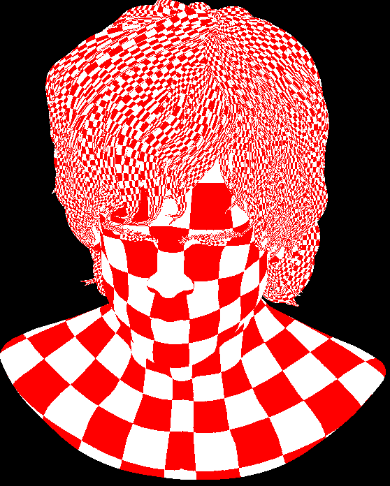

rustrast 07 - Hidden surface removal and lighting
=================================================

For context, see the [main README](../README.md).

This time, I refactor my code to look a little bit more like a modern 3d graphics pipeline.

Throwing some shade
-------------------

The [previous step](../rustrast-06/) got flat shading working, albeit with a very poorly optimised triangle lighting
stage. The result was as expected: a little blocky. The answer to that is some form of smooth shading: either Gouraud,
where the lighting intensity is interpolated, or Phong, where the surface normals are interpolated to calculate a
lighting intensity at each pixel. But it would be good to be able to easily switch between mechanisms to test appearance
and performance.

The concept of a generic, programmable pixel colourer ("shader") made its way originally from Pixar's ultra high end
software to consumer graphics hardware in the very early 2000s, and was soon joined by a programmable replacement for
the transform and lighting step that ended up being called vertex shaders, which is maybe a slightly misleading name.
These work by compiling code in one of a number of C/Java-ish DSLs, which all seem to hide the nature of the underlying
hardware. I'm certainly not writing a compiler for this project, so I decided that the best I could do is some
refactoring so the transform/vertex shading and pixel (aka "fragment") shading are separated from the mechanism to
split workload amongst threads, bin triangles to tiles, determine the fragments in a triangle, interpolate, and
implement the depth buffer.

First, I needed to figure out what a useful minimum set of features would be. I don't want to lose the ability to use
AVX instrinsics or greatly sacrifice speed by adding tight loops and function calls (although I suppose they would be
inlined in this case, given all the code is compiled together). So, I came up with this:

- The vertex shader should be given a chunk of vertex data (coordinates, normals, etc.) to operate on, along with the
  destination for their transformed coordinates. This will allow the shader to do expensive transformation setup once
  per chunk. The shader can store other stuff in its own memory for the vertex shader to use.
- Call the fragment shader for a span of eight pixels. Probably get rid of the non-AVX rasteriser for simplicity. Since
  everything is compiled together the fragment shader should end up being inlined; if not then it would be perfectly
  branch predicted.
- Rather than define a data structure for an arbitrary number of scalars or vertices to be interpolated by the
  rasteriser, and thus add a tight loop, use a macro to implement interpolation, and provide the coefficients to the
  fragment shader so it can interpolate, or not, whatever its associated vertex scheduler prepared.
- Ignore overriding depth in the fragment shader, at least for now.

Note that this design makes it quite tricky to implement flat shading, which is also the case with the various real
libraries: the vertex shader isn't run for a given triangle so there's no concept of a surface normal. I think in the
rare cases where someone wants to flat shade, they either use a model with different surface normals per face for
shared vertices, or use a geometry shader which sits between vertex and fragment shading to calculate the flat shade,
or just do it per pixel in the fragment shader. I decided to keep the existing lighting pass to test the performance
impact of the refactoring on its own.

So, it was time to get to it and find out how far off being workable my plan was. This was the interface I came up, not
considering normals yet:

```rust
pub trait AvxShader : Send + Sync {
    /**
     * Transform the given chunk of vertices and write homogenous coordinates to the output arrays.
     * 
     * # Arguments
     * - iv_offset: Index of the first vertex in the chunk being transformed.
     * - `xs_out`: Transformed vertex x values.
     * - `ys_out`: Transformed vertex y values. Will have the same length as `xs_out`.
     * - `zs_out`: Transformed vertex z values. Will have the same length as `xs_out`.
     * - `ws_out`: Transformed vertex w values. Will have the same length as `xs_out`.
     * - `xs`: Input vertex x values. Will have the same length as `xs_out`.
     * - `ys`: Input vertex y values. Will have the same length as `xs_out`.
     * - `zs`: Input vertex z values. Will have the same length as `xs_out`.
     * - `ws`: Input vertex w values. Will have the same length as `xs_out`.
     */
    unsafe fn vertex(&self, iv_offset: usize,
        xs_out: &mut [__m256], ys_out: &mut [__m256], zs_out: &mut [__m256], ws_out: &mut [__m256],
        xs: &[__m256], ys: &[__m256], zs: &[__m256], ws: &[__m256]);

    /**
     * Calculate the colour of the given 8 fragments.
     * 
     * # Arguments
     * - `it`: Index of the triangle being shaded.
     * - `w0`, `w1`, `w2`: Barycentric weights for the 8 fragments.
     * - `p_w0`, `p_w1`, `p_w2`: Perspective-corrected barycentric weights for the 8 fragments.
     * 
     * # Returns
     * - RGB0 colour values for the 8 fragments
     */
    unsafe fn fragment(&self, it: usize, w0: __m256, w1: __m256, w2: __m256, p_w0: __m256, p_w1: __m256, p_w2: __m256) -> __m256i;
}
```

... with the flat shader being pretty tiny because all it does is transform vertices and look up a colour calculated
before vertex shading takes place.

```rust
#[derive(Clone, Copy)]
struct FlatShader<'a> {
    t: &'a Transformation,
    colours: &'a Vec<i32>
}

impl AvxShader for FlatShader<'_> {
    unsafe fn vertex(&self, _iv_offset: usize,
            xs_out: &mut [__m256], ys_out: &mut [__m256], zs_out: &mut [__m256], iws_out: &mut [__m256],
            xs: &[__m256], ys: &[__m256], zs: &[__m256], ws: &[__m256]) {
        avx_fma_chunk_transformed(xs_out, ys_out, zs_out, iws_out, xs, ys, zs, ws, self.t);
    }

    #[target_feature(enable = "avx")]
    unsafe fn fragment(&self, it: usize, _w0: __m256, _w1: __m256, _w2: __m256, _p_w0: __m256, _p_w1: __m256, _p_w2: __m256) -> __m256i {
        let fill_colour = self.colours[it];
        _mm256_set1_epi32(fill_colour)
    }
}
```

It's hard to tell because of variance, but I think the refactor did absolutely nothing to the transform time, and added
a couple of tenths of a ms to the fill time. That might be because the broadcast to create 8 pixels of the fill colour
is done once per call to the fragment shader rather than once per triangle, although I'd expect that the compiler would
inline and then optimise that. I decided not to bother chasing it as flat shading isn't worth micro-optimising, and I
can't think of a good way to solve it anyway.

Before writing a Gouraud shader, I first had to alter the model loader to duplicate shared vertices with different
normals. After spending about an hour doing that, I found that it wasn't actually necessary for the model I have been
playing with. With that out of the way, the first problem I encountered was one I expected as soon as I made the shader
interface extend `Send`: how can the shader write vertex colours (or transformed normals, or anything else) to its own
storage from multiple threads? I experimented with a buffer pool so each thread could write to a separate buffer, but 
realised that efficiently reading the result in the fragment shader would require copying to a single buffer. I then
realised that I could use a single generic "extras" type and break a mutable slice of that type into the same sized
chunks as I was already creating for coordinate outputs.

The next hurdle was gamma correction: AVX2 has no exponentiation instruction; some languages implement one in software
but not Rust. I used a 1024 entry look up table instead.

The result, before attempting any optimisation beyond what was forced by the shader interface being expressed in AVX
vectors, was pretty straightforward:

```rust
struct GouraudVertexShader<'a> {
    model: &'a Model,
    t: &'a Transformation,
    light_direction: &'a CartesianVector,
    light_intensity: f32,
    ambient_intensity: f32,
    it_world: &'a[[f32; 3]; 3]
}

impl <'a>GouraudVertexShader<'a> {
    fn new(model: &'a Model, t: &'a Transformation, light_direction: &'a CartesianVector, light_intensity: f32, ambient_intensity: f32, it_world: &'a[[f32; 3]; 3]) -> Self {
        Self { model, t, light_direction, light_intensity, ambient_intensity, it_world }
    }
}

impl AvxVertexShader<f32> for GouraudVertexShader<'_> {
    unsafe fn vertex(&self, iv_offset: usize,
            xs_out: &mut [__m256], ys_out: &mut [__m256], zs_out: &mut [__m256], iws_out: &mut [__m256], extras_out: &mut [f32],
            xs: &[__m256], ys: &[__m256], zs: &[__m256], ws: &[__m256]) {
        
        vertices_chunk_transformed(xs_out, ys_out, zs_out, iws_out, xs, ys, zs, ws, self.t);

        let num_vertices = xs.len() * 8;
        for i in 0..num_vertices {
            let vertex_normal = self.model.vertex_normal((iv_offset + i) as u32).transformed(&self.it_world).normalised();
            let diffuse = vertex_normal.dot_product(&self.light_direction).max(0.0) * self.light_intensity;
            let ambient = self.ambient_intensity;
            let intensity = (diffuse + ambient).min(1.0);
            extras_out[i] = intensity;
        }
    }
}

const GAMMA: f32 = 2.2;
const COLOUR_LUT_SIZE: usize = 1024;
static COLOUR_LUT: Lazy<[RGBQUAD; COLOUR_LUT_SIZE]> = Lazy::new(|| {
    array::from_fn(|i| {
        let intensity = i as f32 / (COLOUR_LUT_SIZE - 1) as f32;
        let gamma_corrected_intensity = intensity.powf(1.0 / GAMMA);
        let rgb_value = (gamma_corrected_intensity * 255.0) as u8;
        RGBQUAD {rgbRed: rgb_value, rgbGreen: rgb_value, rgbBlue: rgb_value, rgbReserved: 0}
    })
});

struct GouraudFragmentShader<'a> {
    model: &'a Model,
    intensities: &'a Vec<f32>
}

impl <'a>GouraudFragmentShader<'a> {
    fn new(model: &'a Model, intensities: &'a Vec<f32>) -> Self {
        Self { model, intensities }
    }
}

impl AvxFragmentShader for GouraudFragmentShader<'_> {
    #[target_feature(enable = "avx,avx2,fma")]
    unsafe fn fragment(&self, it: usize, _w0: __m256, _w1: __m256, _w2: __m256, p_w0: __m256, p_w1: __m256, p_w2: __m256) -> __m256i {
        let v0 = self.model.trianglev0s[it] as usize;
        let v1 = self.model.trianglev1s[it] as usize;
        let v2 = self.model.trianglev2s[it] as usize;

        let intensity0 = _mm256_set1_ps(self.intensities[v0]);
        let intensity1 = _mm256_set1_ps(self.intensities[v1]);
        let intensity2 = _mm256_set1_ps(self.intensities[v2]);

        let intensity = interpolate!(intensity0, intensity1, intensity2, p_w0, p_w1, p_w2);
        let clamped_intensity = _mm256_max_ps(_mm256_min_ps(intensity, _mm256_set1_ps(1.0)), _mm256_setzero_ps());
        let scaled_intensity = _mm256_mul_ps(clamped_intensity, _mm256_set1_ps((COLOUR_LUT_SIZE - 1) as f32));
        let lut_index = _mm256_cvtps_epi32(_mm256_round_ps(scaled_intensity, _MM_FROUND_TO_NEAREST_INT | _MM_FROUND_NO_EXC));
        let colours = _mm256_i32gather_epi32(COLOUR_LUT.as_ptr() as *const i32, lut_index, 4);

        return colours;
    }
}
```


Performance was surprising. I was expecting the unoptimised lighting of vertices to add a couple of milliseconds, but in
fact it was only adding about 0.3ms in total per frame. Triangle filling, on the other hand, went from about 3.5ms per
frame to 15ms. The most obvious culprit, to me, looked like loading and broadcasting the vertex intensities. It was
trivial to change the fragment shader interface to have it accept three of a generic extras type, passed through from
the code that called the triangle fill routine. That helped a lot, bringing the fill time down to about 8.5ms per frame.
By commenting out parts, I could tell that about 1ms of that was due to interpolating the intensity, and about 3ms due
to converting the intensity to a colour. First I removed rounding which gained about 1ms. Next, I tried removing the
clamping between 0 and 1, because as it stands, I thought it shouldn't be possible to get out of bounds values. However,
it immediately crashed.

Some debugging later and I realised that the fragment shader is called for pixels outside the triangle by design: even
if I were to add a test for an entire span of 8 being outside, there would still be pixels outside the triangle in the
spans that cross an edge. Also, if in future I were to implement MSAA, that also causes the vertex shader to be run on
extrapolated points by design. So, clamping has to stay. However, there's now enough work being done that testing for a
span being fully outside the triangle in the rasteriser is worth it, to the tune of about another 1.5ms per frame.
Culling spans that entirely fail the depth test shaved off another few tenths. Despite it accounting for just a small
amount of the time per frame, I wrote a version using AVX intrinsics (using `_mm256_rsqrt_ps`, an implementation of the
[notorious fast inverse square root](https://en.wikipedia.org/wiki/Fast_inverse_square_root). This gained under 0.1ms at
best.

To reassure myself that the shader interface was flexible, I implemented a checkerboard shader which was pretty easy:

```rust
impl AvxVertexShader<(f32, f32)> for CheckerBoardVertexShader<'_> {
    unsafe fn vertex(&self, iv_offset: usize,
            xs_out: &mut [__m256], ys_out: &mut [__m256], zs_out: &mut [__m256], iws_out: &mut [__m256], extras_out: &mut [(f32, f32)],
            xs: &[__m256], ys: &[__m256], zs: &[__m256], ws: &[__m256]) {
        vertices_chunk_transformed(xs_out, ys_out, zs_out, iws_out, xs, ys, zs, ws, self.t);

        let num_vertices = xs_out.len() * 8;
        for i in 0..num_vertices {
            let u = self.model.texture_us[iv_offset + i];
            let v = self.model.texture_vs[iv_offset + i];
            extras_out[i] = (u, v);
        }
    }
}

struct CheckerboardFragmentShader {
    size: f32,
    colour1: RGBQUAD,
    colour2: RGBQUAD
}

impl CheckerboardFragmentShader {
    fn new(size: f32, colour1: RGBQUAD, colour2: RGBQUAD) -> Self {
        Self{size, colour1, colour2}
    }
}

impl AvxFragmentShader<(f32, f32)> for CheckerboardFragmentShader {
    unsafe fn fragment(&self, _it: usize, _w0: __m256, _w1: __m256, _w2: __m256, p_w0: __m256, p_w1: __m256, p_w2: __m256, uv0: (f32, f32), uv1: (f32, f32), uv2: (f32, f32)) -> __m256i {
        let u = interpolate!(_mm256_set1_ps(uv0.0), _mm256_set1_ps(uv1.0), _mm256_set1_ps(uv2.0), p_w0, p_w1, p_w2);
        let v = interpolate!(_mm256_set1_ps(uv0.1), _mm256_set1_ps(uv1.1), _mm256_set1_ps(uv2.1), p_w0, p_w1, p_w2);
        let ustep = _mm256_cvtps_epi32(_mm256_div_ps(u, _mm256_set1_ps(self.size)));
        let vstep = _mm256_cvtps_epi32(_mm256_div_ps(v, _mm256_set1_ps(self.size)));
        let uodd = _mm256_and_si256(ustep, _mm256_set1_epi32(1));
        let vodd = _mm256_and_si256(vstep, _mm256_set1_epi32(1));
        let mask = _mm256_cmpeq_epi32(uodd, vodd);
        let colour1 = _mm256_set1_epi32(unsafe { std::mem::transmute::<RGBQUAD, i32>(self.colour1) });
        let colour2 = _mm256_set1_epi32(unsafe { std::mem::transmute::<RGBQUAD, i32>(self.colour2) });
        _mm256_blendv_epi8(colour1, colour2, mask)
    }
}
```

The result was just as ugly as I expected it would be:




~Rust~General thoughts
----------------------

I spent a while writing a reusable buffer pool, which I ultimately didn't use. However, I think I'm getting somewhere
closer to being able to write code involving mutability that will compile first time. Once multi-threading is involved,
though, I'm nowhere close and mostly try what the compiler suggests.
It's clear that the language is a good one for this of work - you are essentially forced to write memory safe
multithreaded code, but right in the hot loops you can take a "trust me bro" attitude with single `unsafe`. Compared to,
say, Java with JNI for the hot loops, that's far simpler. That said, I haven't used any of the modern replacements for
JNI so what do I know?

As with the last step, I took some time before getting to the meat of this step to do some optimisations and cleanups.
One was to switch to a reverse-Z depth buffer, entirely so clearing it uses `memset` and is a few tenths of a ms per
frame faster. See the [previous article](../rustrast-06/) for details. In doing so, I found that my view transform was
wrong and was skewing the z values so I fixed that by copying [the DirectX 
one](https://learn.microsoft.com/en-us/windows/win32/direct3d9/d3dxmatrixlookatrh) and ported it to the older versions.
Debugging was frustrating and I undid the SIMD reorderings I did last time for clarity since it had no effect; I presume
the compiler or the processor itself can do a better job than I can.

Moving working out which edges are top or left into the same step as bounds and area calculation, and explicitly 
SIMD-ing it and the initial edge function values, might have shaved off about 0.05ms per frame; it's hard to tell
signal from noise. Similarly, I realised that tiling had made a small part of the triangle bounds calculation
unnecessary and removing that may have shaved another fraction. It's clear that micro-optimisations may be fun, but not
worth it if they excessively affect readability. But I knew that already.

Next, something I was always fascinated by as a teenager, [rasterising shadows](../rustrast-08/).