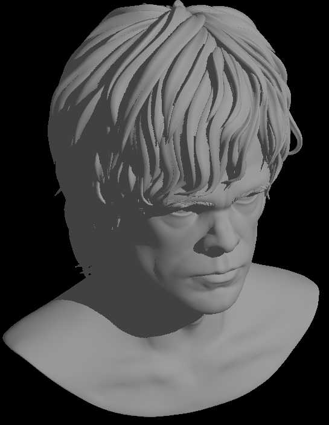
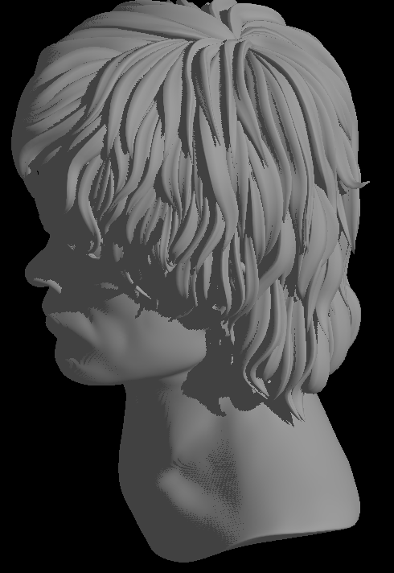
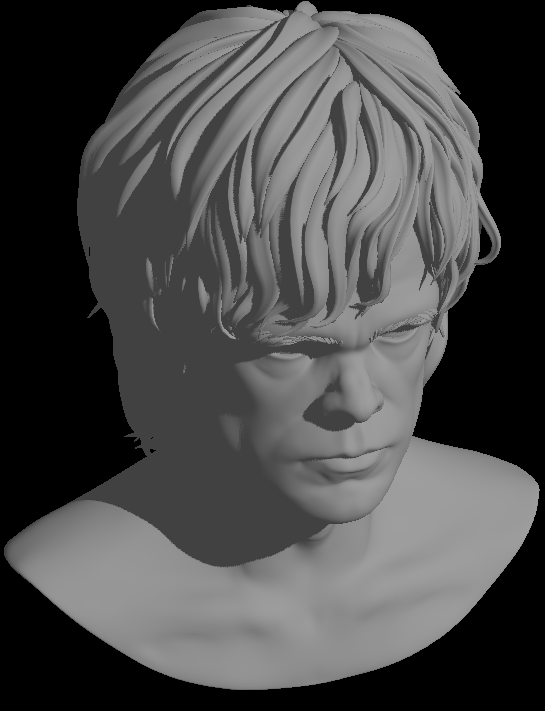
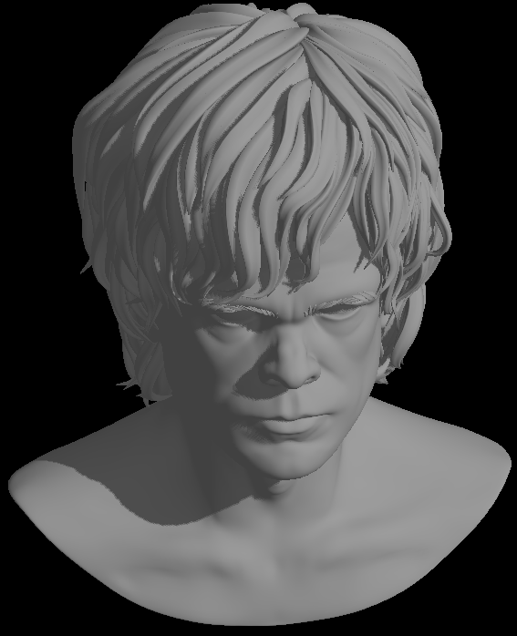

rustrast 08 - Shadows
=====================

For context, see the [main README](../README.md).

It's time to draw some shadows.

Chasing shadows
---------------

When I was around 15, I ran a demo of an upcoming game called [Into the
Shadows](https://www.youtube.com/watch?v=TrPdiapzhZQ) from a cover disc and had my mind blown. I decided the game engine
I was writing would have real time shadows. Of course, that game engine was never written; the typical distractions of a
teenage boy intervened. But still, real time shadows always seemed to be beyond the horizon of what I could do. I can't
remember what my second edition of [Computer Graphics Principles and
Practice](https://archive.org/details/computergraphics0002unse) contained on the topic, but I doubt I would have
understood it well enough in any case.

Reading for this project, I found that there are multiple techniques. One is light maps, which I did understand back
then because they were well documented as part of Quake. Basically, precompute static lighting for every surface in the
whole environment, usually by casting rays from each light source and detecting occlusion. The result is a low
resolution lighting texture that can be blended in the rasteriser. Some DOOM maps used entirely manual light maps: the
designer altered the geometry to draw darker sectors to fake shadows from a static light.

Recently it's become possible to ray trace in real time; I don't intend trying to do that on the CPU.

Another technique is shadow volumes: create a solid shape by projecting the silhouette of an object from the point of
view of the light; the edges of the silhouette are the ones that join a front-facing to a backward-facing surface. Then
use ray tracing again, and work out if the pixel you are rendering is inside a shadow volume. I think the shadows in
that demo were some variation of this technique, although I suspect they may have been precalculated as the demo was
completely non-interactive. Arcade-style ovals on the floor under a character, as in Tomb Raider, could be seen as a
very crude approximation of shadow volumes too.

The technique I decided to use is much simpler: a shadow map. In a first pass, render the scene from the point of view
of the light, and keep just the depth buffer. Then, when drawing the scene from the camera's point of view, interpolate
the light's x, y, and z coordinates across the surface. For each pixel, check if it would have failed the depth test 
from the light's point of view; if so, it's in shadow.

Of course, in reality it's a lot more complex. One of the better articles I found for me, knowing nothing about it, was
in [an OpenGL tutorial](https://learnopengl.com/Advanced-Lighting/Shadows/Shadow-Mapping). Since I was using a
single directional light, the first step was to create an orthographic projection from the light's point of view that
just about contained the model; I did this experimentally but in reality this should be done by projecting the camera
frustrum corners to light space and creating the projection to contain them. For an orthographic projection there's no
need to divide by w, and in fact you can ignore the entire bottom row, so projecting to light space added only about
0.25ms per frame. Clearing a 1024x1024 shadow map, binning to tiles and drawing it added about 5ms, however, and I think
that's about as optimised as it can be. For the main scene, I started with the simplest possible implementation:
default rounding to get shadow map coordinates and a constant bias to avoid stippling ("acne") on lit surfaces:

```rust
#[derive(Clone, Copy)]
struct FragmentExtra {
    diffuse_intensity: __m256,
    shadow_map_x: __m256,
    shadow_map_y: __m256,
    shadow_map_z: __m256
}

impl AvxFragmentShader<RUN_FRAGMENT_SHADER, FragmentExtra> for FragmentShader<'_> {
    unsafe fn fragment(&self, _it: usize, _w0: __m256, _w1: __m256, _w2: __m256, p_w0: __m256, p_w1: __m256, p_w2: __m256, extra0: FragmentExtra, extra1: FragmentExtra, extra2: FragmentExtra, mask: __m256i) -> (__m256i, __m256i) {
        let shadow_map_x = interpolate!(extra0.shadow_map_x, extra1.shadow_map_x, extra2.shadow_map_x, p_w0, p_w1, p_w2);
        let shadow_map_y = interpolate!(extra0.shadow_map_y, extra1.shadow_map_y, extra2.shadow_map_y, p_w0, p_w1, p_w2);
        let shadow_map_z = interpolate!(extra0.shadow_map_z, extra1.shadow_map_z, extra2.shadow_map_z, p_w0, p_w1, p_w2);
        let shadow_map_z = _mm256_add_ps(shadow_map_z, _mm256_set1_ps(0.001)); // bias to avoid shadow acne

        let shadow_map_x_int = _mm256_min_epi32(_mm256_max_epi32(_mm256_cvtps_epi32(shadow_map_x), _mm256_setzero_si256()), _mm256_set1_epi32((SHADOW_MAP_SIZE - 1) as i32));
        let shadow_map_y_int = _mm256_min_epi32(_mm256_max_epi32(_mm256_cvtps_epi32(shadow_map_y), _mm256_setzero_si256()), _mm256_set1_epi32((SHADOW_MAP_SIZE - 1) as i32));
        let shadow_map_index = _mm256_add_epi32(_mm256_mullo_epi32(shadow_map_y_int, _mm256_set1_epi32(SHADOW_MAP_SIZE as i32)), shadow_map_x_int);
        let shadow_map_depth = _mm256_i32gather_ps(self.shadow_map.as_ptr() as *const f32, shadow_map_index, 4);

        let not_in_shadow = _mm256_cmp_ps(shadow_map_z, shadow_map_depth, _CMP_GE_OQ);
        
        let diffuse_intensity = interpolate!(extra0.diffuse_intensity, extra1.diffuse_intensity, extra2.diffuse_intensity, p_w0, p_w1, p_w2);
        let diffuse_intensity = _mm256_and_ps(diffuse_intensity, not_in_shadow);

        let intensity = _mm256_add_ps(diffuse_intensity, self.ambient_intensity);

        let clamped_intensity = _mm256_max_ps(_mm256_min_ps(intensity, _mm256_set1_ps(1.0)), _mm256_setzero_ps());
        let scaled_intensity = _mm256_mul_ps(clamped_intensity, _mm256_set1_ps((COLOUR_LUT_SIZE - 1) as f32));
        let lut_index = _mm256_cvtps_epi32(scaled_intensity);
        (_mm256_i32gather_epi32(COLOUR_LUT.as_ptr() as *const i32, lut_index, 4), mask)
    }
}
```

The result was surprisingly good:



Smooth operator
---------------

There were problems, however, and reducing the size of the shadow map to 512x512 to save a few milliseconds shows them
clearly:



The shadows are blockier, and exhibit some acne due to the bias being too small. One technique to get rid of shadow acne
is to draw just backward facing surfaces to the shadow buffer; however when I tried this it added some gaps in the
shadows (the wonderfully-named "Peter Panning"), so instead I tried adjusting the bias based on the angle of the surface
to the light as suggested in most tutorials. The fragment shader is already calculating something very similar to the
dot product of the surface normal and the light direction: the interpolated diffuse lighting intensity. This gave good
results after some tweaking of the minimum and maximum bias.

Shadows were still blocky, particularly with the lower resolution shadow map. To help solve this I did a version of
percentage closer filtering, testing the four shadow map texels around the interpolated location and averaging the
result. I believe this is exactly what OpenGL's
[sampler2DShadow](https://wikis.khronos.org/opengl/Sampler_(GLSL)#Shadow_samplers) does. The result, particularly with
the higher resolution shadow map, was pretty good:



Unfortunately, this is a bit slow. At full screen, simple Gouraud shading took about 8ms per frame in total. With a
512x512 shadow map and no filtering, it's 15ms, and with a 1024x1024 shadow map and PCF, it's close to 18ms. Still, the
difference in realism is well worth it, and watching the shadows move as the model rotates is mesmerising.

Ambient jazz
------------

With a single light, areas in shadow are completely flat. The answer to this is [ambient
occlusion](https://en.wikipedia.org/wiki/Ambient_occlusion): use the shape of an object to make a guess at how much
ambient light gets to each fragment. I chose instead to make shadows heavily darken, not remove, the diffuse component,
which makes for a pleasing effect:



Rusting away
------------

I had to take a step backwards in correctness this time: the depth buffer no longer uses safe chunks, but is now passed
to the tile threads unsafely just like the colour buffer. This is to simplify reading from it when it's used as a shadow
map. I'm comfortable with that: the code is safe as multiple threads are using disjoint parts of the buffers.

I took some time after finishing to revisit some parts of the code. I moved binning into its own module and combined the
properties and binning steps. By converting more of it to explicit SIMD I shaved off a few tenths. Much bigger was
changing from rasterising 8x1 pixel spans to 4x2 pixel blocks. While this means the reads and stores have more code, the
tighter tolerances around the edges of triangles leading to fewer fragment shader calls was helpful: about 1.5ms per
frame, bringing the total to just over 15ms.

Next, it's time to get rid of stairstep edges by [anti-aliasing](../rustrast-09/).