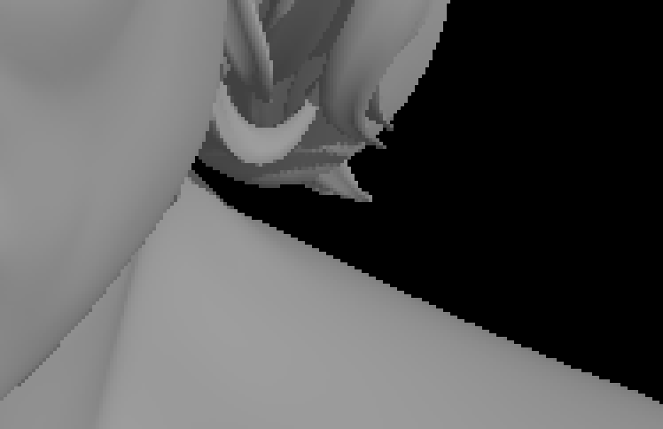
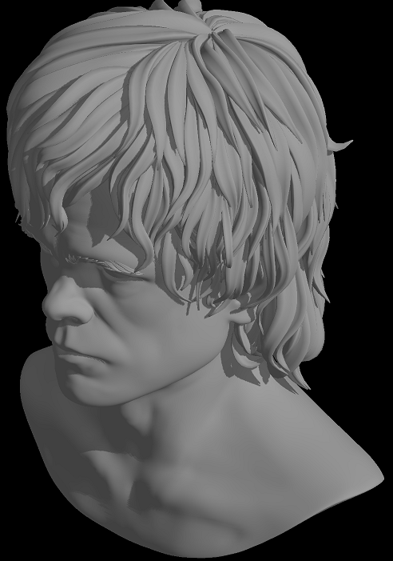
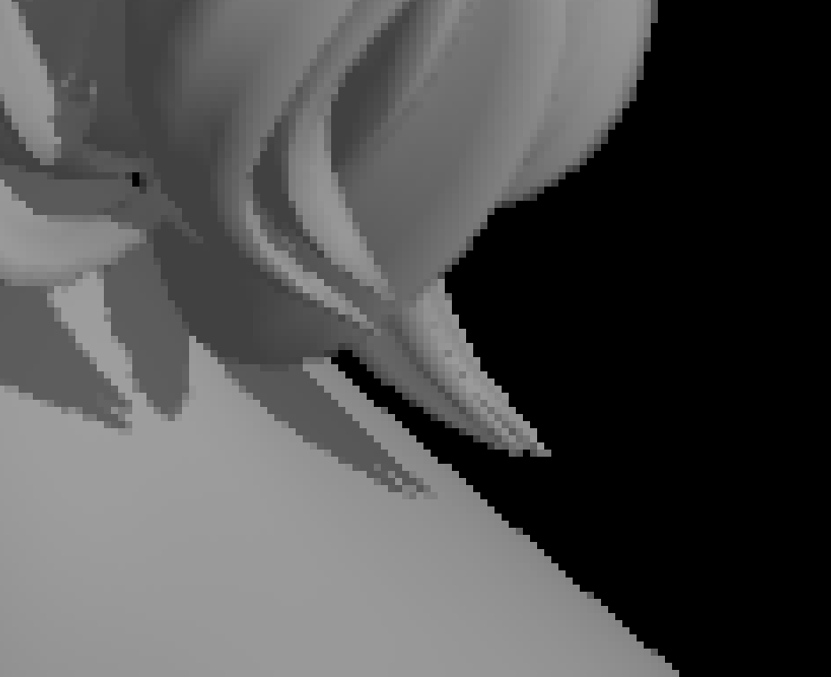
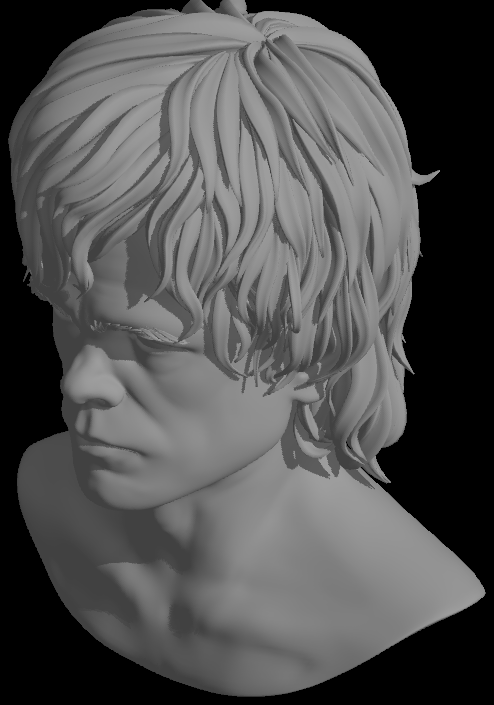

rustrast 09 - Anti-aliasing
===========================

For context, see the [main README](../README.md).

This time around I implement MSAA to get rid of jaggies.

No Stairway - denied!
---------------------

Because a pixel either is or isn't a triangle, the edges of the model are stair-stepped:



It's actually not that obvious when in motion, but slowed down or stationary it is. The answer has always been some form
of antialiasing, so a pixel that is incompletely overlapped by a triangle is averaged with the background. The simplest
way to do this is to supersample by drawing to a larger buffer and then downsample with a filter. Doing this with a
buffer twice the width and height was trivial:



However, it was astonishingly slow. The main cause wasn't actually triangle filling: it was the `StretchBlt` with
`HALFTONE` as the mode that took 35ms per frame. `StretchDIBits` is identical. I presume there is absolutely no hardware
acceleration or even on-CPU SIMD involved. So the first problem I had to solve was that. A quick test showed that the
`COLORONCOLOR` mode when resizing down to 50% selected even rows and odd columns and was only barely slower that a
regular `BitBlt` with the same target size. However, I decided to try averaging fragment colours to the top left corner
of the colour buffer so I could keep using `BitBlt`. This was surprisingly tricky due to swizzling, but eventually this
yielded itself:

```rust
pub fn downsample_2x2(out: &mut [RGBQUAD], out_buffer_size: &BufferSize, colour: &[RGBQUAD], colour_buffer_size: &BufferSize, left: usize, top: usize, width: usize, height: usize) {
    debug_assert!(out.as_ptr().align_offset(32) == 0);
    debug_assert!(out_buffer_size.stride % 4 == 0);
    debug_assert!(colour.as_ptr().align_offset(32) == 0);
    debug_assert!(colour_buffer_size.stride % 8 == 0);
    debug_assert!(left % 8 == 0);
    debug_assert!(top % 2 == 0);

    unsafe {
        let out_top = top / 2;
        let out_left = left / 2;
        let mut out_row = out.as_mut_ptr().add(out_top * out_buffer_size.stride + out_left) as *mut __m128i;
        let mut in_row0 = colour.as_ptr().add(top * colour_buffer_size.stride + left) as *mut __m256i;
        let mut in_row1 = in_row0.add(colour_buffer_size.stride / 8);
        for _ in (0..height).step_by(2) {
            for x in 0..((width + 7) / 8) {
                let vavg = _mm256_avg_epu8(*in_row0.add(x), *in_row1.add(x));

                // 0, 0, 1, 1, 2, 2, 3, _ 
                let avg = _mm256_avg_epu8(vavg, _mm256_srli_si256(vavg, 4));

                // 0, 1, _, _, 2, 3, _, _ 
                let avg = _mm256_shuffle_epi32(avg, 0b0000_1000);

                //                 0, 1, _ _                    2, 3, _ _
                // =>
                // 0, 1, 2, 3
                let avg = _mm_unpacklo_epi64(_mm256_castsi256_si128(avg), _mm256_extracti128_si256(avg, 1));

                _mm_store_si128(out_row.add(x), avg);
            }
            out_row = out_row.add(out_buffer_size.stride / 4);
            in_row0 = in_row0.add(colour_buffer_size.stride / 8 * 2);
            in_row1 = in_row1.add(colour_buffer_size.stride / 8 * 2);
        }
    }
}
```

It requires slightly more buffer padding to allow 8x4 fragments to be processed at once. Performance was OK: about 2ms
per frame. However, the downsampling is single threaded and not amenable to being multithreaded being in-place like that
so I switched to rendering to a separate buffer and downsampling each tile, and shaved off 0.75ms. All in, supersampling
more than doubled the time taken per frame.

Supersampling was reasonably common in the early days of hardware acceleration, but as seen, it's extremely expensive in
terms of computation. Hence, a technique called multisampling (MSAA) was developed: draw to a larger buffer (and depth
buffer) as with supersampling, but only carry out the inside test multiple times per screen pixel: call the pixel shader
just once. At the end, like with supersampling, the buffer is downsampled using a filter to the screen. As with
everything I've experimented with, there's nuance: the locations within the pixel are usually arranged in a [rotated
fashion](https://learn.microsoft.com/en-us/windows/win32/api/d3d11/ne-d3d11-d3d11_standard_multisample_quality_levels)
to reduce artefacts; and the simplest versions run the pixel shader for a fixed location in the pixel which might be
slightly outside the triangle (although it's possible to use the centroid of the samples that are inside the triangle,
or simply one of their locations, instead, for a small performance penalty).

There's nothing particularly interesting about the implementation. I made a lot of use of Rust's constant generics to
ask the compiler to specialise the rasteriser, although I think it would probably do that even if I simply passed an
antialiasing mode as a normal parameter. For 4x MSAA I chose to store samples out of order in the colour buffer to avoid
shuffling both when storing and when downsampling; I did the same for 2x MSAA although it doesn't improve performance in
that case.

I also found that the triangles in the model I'm using are so small that it is necessary to give the fragment shader a
point inside the triangle (rather than any sample or the pixel centre) to avoid overly bright or dark spots caused by
extrapolation.

Alpha, Beta, Gamma
------------------

Averaging colours that have already been gamma corrected is wrong: it needs to be done on linear colour components and
the end result then needs to be gamma corrected to avoid incorrect colours at edges. However, simply storing 8 bit RGB
to the colour buffer and then correcting the result would lose a lot of precision by mapping multiple linear colours to
the same output colour. While at this stage the fragment shader is producing a basic intensity which could be linearly
averaged, I obviously want to support full colour. There are a few options: I could store floating point components to
the colour buffer, but this would increase storage requirements fourfold. AVX512 has 16 bit floats which would help but
my aging machine doesn't support it.

Another option is to use some of the bits currently doing nothing in the reserved octet of each `RGBQUAD`, and instead
use them for extra colour component bits. [OpenGL calls the obvious format
`RGB10_A2`](https://wikis.khronos.org/opengl/Image_Format#Special_color_formats). That obviously leads to the question
of how to average these. Searching for this will lead to a lot of mentions of a bit twiddling technique to average
numbers without overflow that can be used in a SIMD-within-a-register fashion; however most fail to mention the required
masking or the need to round up to avoid averages-of-averages being pulled towards zero. [Even the fantastic Raymond
Chen skips this](https://devblogs.microsoft.com/oldnewthing/20220207-00/?p=106223). However I found [a great article on
the topic](https://medium.com/@luc.trudeau/fast-averaging-of-high-color-16-bit-pixels-cb4ac7fd1488) that explains why it
works and the complete technique.

The average of two RGB10_A2 values is thus:

```
(((a ^ b) & !LSBS) >> 1) + (a & b) + ((a ^ b) & LSBS)
```

... or, eight operations per average calculation (of which one is needed per SIMD unit for 2x MSAA and three for both 4x
MSAA and 2x supersampling):

```rust
const LSBS: i32 = 0b00000000_00010000_00000100_00000001;
macro_rules! avg_rgb10_a2 {
    ($a:expr, $b:expr) => {{
        let sums = _mm256_xor_epi32($a, $b);
        let half_sums = _mm256_srli_epi32(_mm256_and_si256(sums, _mm256_set1_epi32(!LSBS)), 1);
        let carries = _mm256_and_si256($a, $b);
        let floor_avg = _mm256_add_epi32(half_sums, carries);
        let rounded_avg = _mm256_add_epi32(floor_avg, _mm256_and_si256(sums, _mm256_set1_epi32(LSBS)));
        rounded_avg
    }};
}
```

The result then has to be gamma corrected and converted to RGB8 which can be done by or-ing
together a lookup per component:

```rust
const GAMMA: f32 = 2.2;
const COMPONENT_LUT_SIZE: usize = 1024;
fn init_colour_lut(shift: usize) -> [i32; COMPONENT_LUT_SIZE] {
    array::from_fn(|i| {
        let intensity = i as f32 / (COMPONENT_LUT_SIZE - 1) as f32;
        let gamma_corrected_intensity = intensity.powf(1.0 / GAMMA);
        ((gamma_corrected_intensity * 255.0) as i32) << shift
    })
}
static RED_LUT: Lazy<[i32; COMPONENT_LUT_SIZE]> = Lazy::new(|| init_colour_lut(16));
static GREEN_LUT: Lazy<[i32; COMPONENT_LUT_SIZE]> = Lazy::new(|| init_colour_lut(8));
static BLUE_LUT: Lazy<[i32; COMPONENT_LUT_SIZE]> = Lazy::new(|| init_colour_lut(0));

macro_rules! gamma_correct_8 {
    ($rgb10_a2:expr) => {{
        let mask = _mm256_set1_epi32(0x3FF);
        let red = _mm256_i32gather_epi32(RED_LUT.as_ptr(), _mm256_and_si256(_mm256_srli_epi32($rgb10_a2, 20), mask), 4);
        let green = _mm256_i32gather_epi32(GREEN_LUT.as_ptr(), _mm256_and_si256(_mm256_srli_epi32($rgb10_a2, 10), mask), 4);
        let blue = _mm256_i32gather_epi32(BLUE_LUT.as_ptr(), _mm256_and_si256($rgb10_a2, mask), 4);
        _mm256_or_si256(_mm256_or_si256(red, green), blue)
    }};
}
```

Quality is remembered long after price is forgotten
---------------------------------------------------

None of this is fast. Even moving gamma correction out of the fragment shader, with no anti aliasing at all, adds about
1.5ms per frame. However the cost is from processing full colour rather than grayscale so is necessary.

Over and above that extra 1ms, supersampling adds about 12ms per frame; 4x MSAA about 8ms; and 2x MSAA about
3ms. I'm not sure the quality is worth even that:


Note how poorly 2x MSAA handles edges where the slope is similar to how the subsamples are distributed in the pixel:



An old technique called temporal antialiasing improved this by using a complementary subsample pattern each alternate
frame. I'm also sure I've seen something online that suggested using a different pattern on alternate pixels, so I tried
that:



Modern 3D hardware tends to use various post-processing techniques based on edge detection and filters instead of MSAA;
these are proprietary so I can't implement one.

Fully rusted out
----------------


 [](../rustrast-10/).

